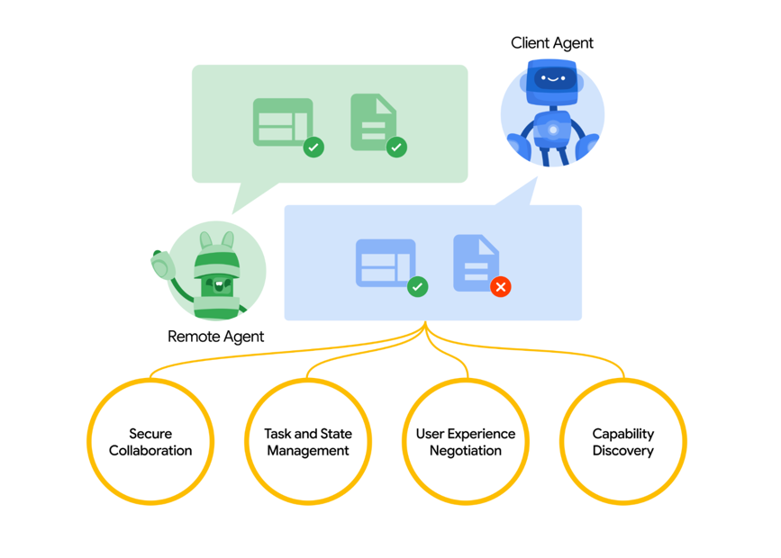

## A2A

官方文档：
https://developers.googleblog.com/en/a2a-a-new-era-of-agent-interoperability/



```markdown
A2A facilitates communication between a "client" agent and a “remote” agent. A client agent is responsible for formulating and communicating tasks, 
while the remote agent is responsible for acting on those tasks in an attempt to provide the correct information or take the correct action.
This interaction involves several key capabilities:

Capability discovery: Agents can advertise their capabilities using an “Agent Card” in JSON format, allowing the client agent to identify the best agent that can perform a task and leverage A2A to communicate with the remote agent.
Task management: The communication between a client and remote agent is oriented towards task completion, in which agents work to fulfill end-user requests. This “task” object is defined by the protocol and has a lifecycle. It can be completed immediately or, for long-running tasks, each of the agents can communicate to stay in sync with each other on the latest status of completing a task. The output of a task is known as an “artifact.”
Collaboration: Agents can send each other messages to communicate context, replies, artifacts, or user instructions.
User experience negotiation: Each message includes “parts,” which is a fully formed piece of content, like a generated image. Each part has a specified content type, allowing client and remote agents to negotiate the correct format needed and explicitly include negotiations of the user’s UI capabilities–e.g., iframes, video, web forms, and more.
```


### 拓展资料
https://mp.weixin.qq.com/s/n1R-wOtNBTKtHdIHOUhQmw

https://mp.weixin.qq.com/s/7vhKce3IPgjzbLiT0Cgjbw