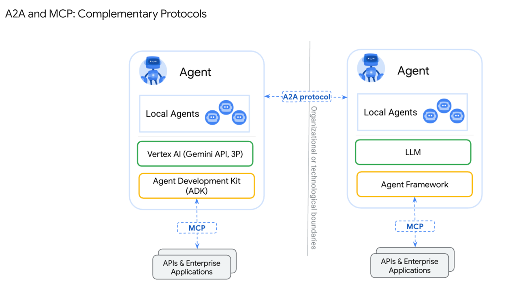
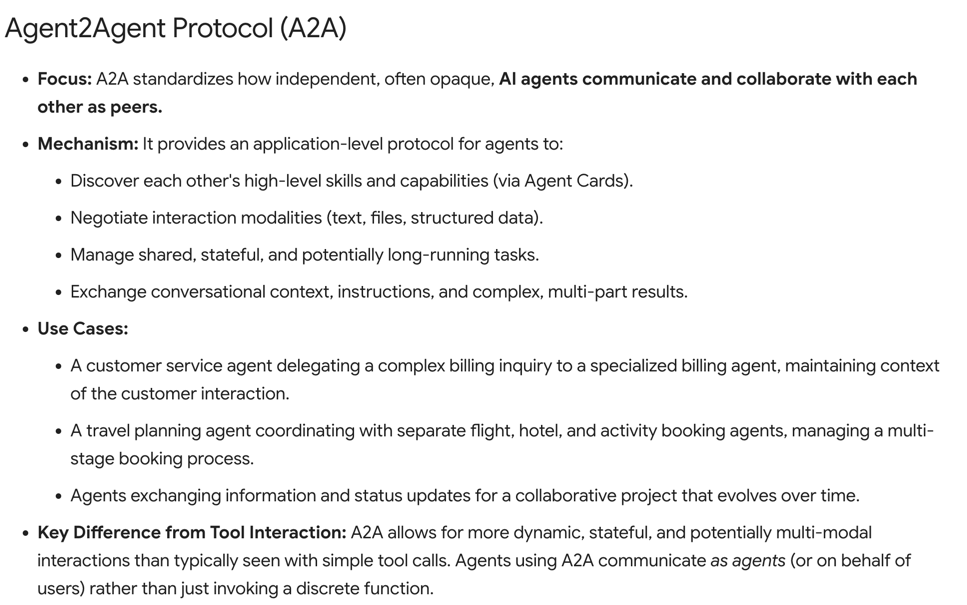
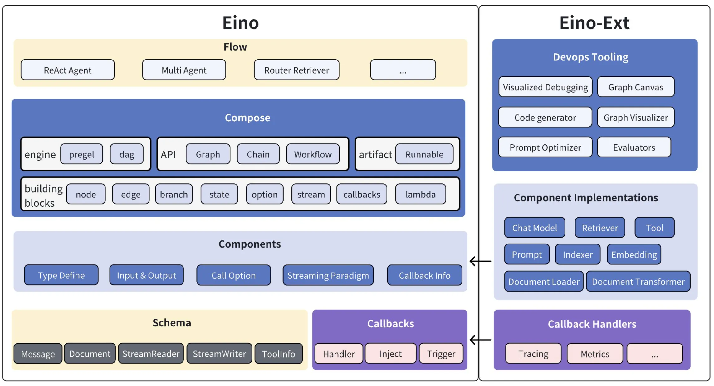

## agent

agent的开发规范(发展历程)
LLM agent   -> 单agent（single agent）  -> 多agent(multiple agent)

LLM Agent
```text
多模态
system prompt

只基于聊天的模式展示，同时也只限于模型训练截止的知识，对后面的知识是不知道的

同时大模型存在幻觉，返回的信息并不总是真实的，而且智能体的输出存在随机性、不可控的问题，直接通过LLM+提示词工程创建的Agent，无法很好承载严肃场景的需求。
```

single ai agent
```text
包含: LLM(多模态，system prompt)
规划，记忆，工具调用  等能力

打破了LLM只有训练前的知识的局限，LLM可以通过意向分析，上下文记忆分析，封装参数调用工具，然后获取到最新的数据知识，然后再总结返回给用户

规划：智能通能过通过分析用户的问题，分析用户意向，将问题拆解成多个步骤，从而形成执行规划 （依靠的大模型的意图识别和流程控制）

记忆: 可以存放用户问题的上下文信息（包括但不限于用户之前的提问和LLM的回答）

工具调用： 开发者给agent提供相关工具(即该agent具备或者什么数据的能力)，LLM根据意向封装参数调用

缺点是：
  单agent只能解决特定领域的问题，成为某一个领域的专家，但不能成为所有领域的专家，我们期望它可以解决各个领域问题； --- 此时就需要多个agent协调工作

  单个Agent很难在所有领域都达到专家级水平，例如一个通用Agent可能无法同时精通AI画图、AI编程、拍照解题等技能，各个技能的规划执行流程不同，使用的工具也不尽相同，这使得在同一个AI Agent通用的执行流程中，很难让所有技能都达到精通水平
```

multiple agent
```text
包含: 多个个single ai agent

在使用multi agent时，内部可以调用多个agent协调，处理用户的问题
例如，在软件开发场景中，可以有产品经理Agent负责对接用户进行需求分析、架构师Agent负责系统设计、程序员Agent负责代码实现、测试工程师Agent负责质量保证，它们协同工作完成整个软件开发生命周期

例如典型的多Agent系统如MetaGPT开源项目 https://github.com/FoundationAgents/MetaGPT

多Agent系统有以下几个核心优势：
任务聚焦：单个智能体专注特定任务，比多工具选择更高效。
独立优化：可单独改进单个智能体，不影响整体流程。
问题拆解：将复杂问题拆分为可处理的子任务，由专业智能体处理。

也可以人为介入：专业判断、质量把控、异常处理、持续优化
```

### agent 协议
协议是一套标准化的规则和约定，定义了不同系统或组件之间如何进行通信和交互，例如数据格式、通信流程、错误处理机制等关键要素，确保不同的系统能够准确、可靠地交换信息

定义的标准协议具有以下特点:
```text
互操作性：标准协议使得不同技术栈、不同厂商开发的Agent能够无缝协作，打破了技术壁垒，促进了整个生态系统的繁荣发展。    -- 统一战线，促进发展
可扩展性：通过标准化的接口规范，新的Agent可以快速接入现有系统，而无需重新设计整套通信机制，大大降低了系统扩展的复杂度。 -- 快速接入
降低开发成本：开发者无需为每个Agent单独设计通信协议，可以专注于Agent的核心业务逻辑，提高开发效率。 -- 让用户专注业务
生态建设：标准协议促进了工具和服务的标准化，使得社区能够共享优秀的Agent实现，加速整个行业的发展。   -- 资源共享，相互学习
维护便利性：统一的协议标准使得系统维护、调试和监控变得更加简单，降低了运维成本。          -- 降低学习，运维成本
```

在Agent领域，按交互对象来区分，可以分为 Context-Oriented (面向上下文) 和 Inter-Agent (面向 Agent 间) 两种。其中面向上下文的协议以 MCP 为代表，面向 Agent 间的协议以 A2A 为代表
```text

    上下文信息                      agent-A                         agent-B
    resources                   
    prompts       mcp协议                     ----A2A协议----      
    tools                          LLM                           tool  LLM
```
其中 MCP协议，表示agent可以通过mcp协议，调用工具获取数据信息
A2A协议，表示让agent-A 和agent-B可以相互通信，相互协作

#### 面向上下文协议：MCP
解决 Agent 如何从外部世界（数据、工具、服务）获取完成任务所需信息（上下文）的问题

MCP（Model Context Protocol） 协议作为AI届的USB-C
https://modelcontextprotocol.io/docs/getting-started/intro
MCP主要采用 Client - Server 架构,主要包含以下组件信息：
- Host ： 通常指的是LLM发起方程序(包含Client，目的是连接Server获取数据)，比如Claude Desktop、IDE 插件；同时也承担着集成外部工具、访问多样化数据资源的任务
- Client ： 主要与Server建联 1：1，负责处理协议协商和消息路由，本质就是通过client端连接server端获取数据
- Server ： 外部暴露mcp协议的接口，可以获取到业务数据，比如(文件、数据库等等)

目前MCP中定义的tool格外重要，目前使用最多的也是tool

#### 面向Agent间协议：A2A
面向Agent间的协议主要是为了规范 Agent 之间的沟通、发现和协作。
A2A（Agent2Agent）
https://a2a-protocol.org/latest/




A2A的能力：参考如下
https://a2a-protocol.org/latest/topics/a2a-and-mcp/#model-context-protocol-mcp
```text
能力发现：智能体通过JSON格式的"Agent Card"宣传自身能力，便于其他Agent发现和调用最合适的智能体。
任务和状态管理：以任务为导向，协议定义了任务对象及其生命周期，支持任务的分发、进度同步和结果（工件）输出，适配长短任务场景。
协作与消息交换：智能体之间可发送消息，交流上下文、回复、工件或用户指令，实现多智能体间的高效协作。
用户体验协商：每条消息可包含不同类型的内容片段（如图片、表单、视频等），支持客户端和远程Agent协商所需的内容格式和UI能力
```


#### Function Call vs MCP vs A2A

Function Call不是协议，是大模型提供的一种能力;
MCP里的工具调用，是基于Function Call能力实现的，对于工具来说，MCP和Function Call是依赖关系。

##### Function Call vs MCP
Function Call 是大模型提供的基础能力，允许模型根据自然语言指令自动调用预定义函数，实现与外部工具的连接，但它并非统一标准 --- 用户可以根据自身情况实现Function Call工具，并供大模型调用

MCP（模型上下文协议）则是跨模型、跨工具的统一交互标准，不仅规范了工具调用（如函数描述、参数格式），还整合了 Prompts、资源管理等上下文体系，
目标是成为 AI 生态的 "USB-C"，让工具只需按统一协议封装一次，即可在多模型中通用，大幅降低跨平台适配成本

##### MCP vs A2A
MCP主要解决"Agent如何用好工具"，通过标准化工具接口，极大提升了工具复用和生态兼容性。

A2A则解决"多个Agent如何协作"，通过标准化Agent间通信，推动了多Agent系统的互操作和协作创新

目前两个协议的边界还比较清晰，但是后续如何发展，会不会整合成一个协议，或者被其他协议替代呢？ 主要有以下的原因
```text
目前：
MCP 主要是统一调用外部工具的规范   --- 结构化数据
A2A 是agent之间的相互访问的规范   --- 自然语言

但是对于一次访问来说，返回的是结构化数据还是自然语言是无差别的，只能是能让大模型理解即可


MCP会更适合那些交互模式类似于传统API调用的场景。当你需要Agent作为工具执行者，关注明确的输入和输出，且交互流程相对固定时，MCP的结构化和工具导向特性会更具优势。它强调的是Agent如何高效、规范地使用外部工具，补充模型上下文。
A2A更适用于需要多个Agent进行复杂协作、对话式交互和任务共同完成的场景。A2A关注的是Agent之间的消息传递、状态同步以及最终的输出制品。如果系统需要Agent之间进行动态协商、分工合作，并且结果的达成比固定的交互流程更重要，那么A2A会是更合适的选择
```

### Agent思考框架
主流的Agent思考框架，如ReAct和Plan-and-Execute


#### 思维链
思维链（Chain of Thought, CoT）是一种增强大型语言模型（LLM）处理复杂推理任务能力的关键技术； 局限是：只能处理推理过的数据，缺乏实时数据

Anthropic官方还开源了Sequential Thinking MCP
https://github.com/modelcontextprotocol/servers/tree/main/src/sequentialthinking

https://mcp.so/ranking

#### ReAct
ReAct（Reasoning and Action）框架通过将"推理"（Reasoning）与"行动"（Action）相结合，有效地解决了"局限于模型内部知识，缺乏与外部世界的实时交互，知识陈旧、幻觉和错误传播"的问题
```text
它允许模型在推理过程中与外部工具或环境进行互动，从而获取最新信息、执行具体操作，并根据反馈调整后续步骤。
这种动态的交互赋予了模型一种"边思考边行动、边观察边调整"的能力，
其核心运作机制可以概括为思考（Thought）→ 行动（Action）→ 观察（Observation）的迭代循环
```

#### Plan-and-Execute
Plan-and-Execute 是一种对标准 ReAct 框架的扩展和优化，旨在处理更复杂、多步骤的任务
```text
规划阶段： 将问题分解，拆分成多个子任务
        Agent 首先对接收到的复杂任务或目标进行整体分析和理解。然后，它会生成一个高层次的计划，将原始任务分解为一系列更小、更易于管理的子任务或步骤
执行阶段:  按照规划阶段拆分的子任务执行各个子任务；监控子任务执行情况(如果子任务执行成功，就执行下一个任务，如何子任务执行失败，就要评估当前的规划，然后动态调整规划，重新执行)
        它会按照规划好的步骤逐一执行每个子任务。在执行每个子任务时，Agent 可以采用标准的 ReAct 循环来处理该子任务的具体细节，例如调用特定工具、与外部环境交互、或进行更细致的推理
```
plan-and-execute 比 ReAct的优势
```text
结构化与上下文优化：通过预先规划将复杂任务分解为小步骤，不仅使 Agent 行为更有条理，还有效减少了执行各子任务时的上下文长度，提升了处理长链条任务的效率和稳定性。 -- 化整为零，各个步骤执行结果明细

降低复杂性：将大问题分解为小问题，降低了单步决策的复杂性。如果某个子任务失败，影响范围相对可控，也更容易进行针对性的调整。

增强可解释性与人机协同：清晰的计划和分步执行过程使得 Agent 的行为更容易被理解和调试。更重要的是任务的分解为用户在规划审批和执行监控等环节的参与提供了便利，用户可以对任务的执行步骤给出修改意见，从而实现更高效的人机协作，确保任务结果更符合预期。
```

### 开发框架
目前AI Agent领域的主流框架生态主要集中在Python和Javascript技术栈，例如：OpenAI的Agents SDK、谷歌的Agent Development Kit 、微软的AutoGen、LangChain的升级版LangGraph等
https://www.langchain.com/langgraph

#### Eino
Eino 框架由以下几个部分组成，其中Eino为核心框架逻辑，包含类型定义、流处理机制、组件抽象、编排功能、切面机制等，Eino-Ext为一些具体组件的实现，例如DeepSeek ChatModel、Langfuse Callbacks等



eino-ext langfuse
https://github.com/cloudwego/eino-ext/tree/main/callbacks/langfuse


```text
模块化和标准化：将一系列功能相同的能力抽象成统一的模块，组件间职能明确、边界清晰，支持灵活地组合。
可扩展性：接口的设计保持尽可能小的模块能力约束，让组件的开发者能方便地实现自定义组件的开发。
可复用性：把最常用的能力和实现进行封装，提供给开发者开箱即用的工具使用。
```

对话处理类组件
```text
ChatTemplate 主要作用是将用户提供的变量值填充到预定义的消息模板中，生成用于与语言模型交互的标准消息格式
type ChatTemplate interface {
    Format(ctx context.Context, vs map[string]any, opts ...Option) ([]*schema.Message, error)
}

ChatModel 主要作用是将用户的输入消息发送给语言模型，并获取模型的响应
type BaseChatModel interface {
    Generate(ctx context.Context, input []*schema.Message, opts ...Option) (*schema.Message, error)
    Stream(ctx context.Context, input []*schema.Message, opts ...Option) (
        *schema.StreamReader[*schema.Message], error)
}

type ToolCallingChatModel interface {
    BaseChatModel

    // WithTools returns a new ToolCallingChatModel instance with the specified tools bound.
    // This method does not modify the current instance, making it safer for concurrent use.
    WithTools(tools []*schema.ToolInfo) (ToolCallingChatModel, error)
}
```

文本语义处理类组件
```text
Document.Loader、Document.Transformer
Embedding
Indexer： 用于构建向量数据库的
Retriever：召回，主要用于RAG场景
```

决策执行类组件
```text
ToolsNode：是一个用于扩展模型能力的组件，它允许模型调用外部工具来完成特定的任务
```

自定义组件
```text
Lambda  中的交互模式如下：

交互模式	输入类型	输出类型	适用场景
Invoke	普通	普通	同步调用，输入输出都是普通数据，如参数校验、数据转换等
Stream	普通	流式	需要流式输出的场景，如生成文本、语音等
Collect	流式	普通	需要收集流式输入并汇总的场景，如文本摘要、数据分析等
Transform	流式	流式	流式数据转换场景，如实时翻译、实时语音转文字等
```

编排（Compose）
```text
Eino通过深入洞察大模型应用的本质特征，提出了基于有向图（Graph）模型的编排解决方案。在这个模型中，各类原子能力组件（Components）作为节点（Node），通过边（Edge）串联形成数据流动网络。每个节点承担特定职责，节点间以上下游数据类型对齐为基本准则，实现类型安全的数据传递。
```

Graph：运行图, eino通过有向图来组织AI的处理流程
```text
compose.NewGraph
g.AddChatTemplateNode("ChatTemplate", promptTemplate)
g.AddChatModelNode("ChatModel", chatModel,
g.AddToolsNode("ToolNode", toolsNode)

 g.AddEdge(compose.START, "ChatTemplate") // edge:1
 g.AddEdge("ChatTemplate", "ChatModel") // edge:2
 g.AddBranch("ChatModel", compose.NewGraphBranch  // 分支判断

```

Callbacks: 切面， 通过切面来实现logging、tracing、metrics等可观测能力
```text
const (
    TimingOnStart CallbackTiming = iota // 进入并开始执行
    TimingOnEnd // 成功完成即将 return
    TimingOnError // 失败并即将 return err 
    TimingOnStartWithStreamInput // OnStart，但是输入是 StreamReader
    TimingOnEndWithStreamOutput // OnEnd，但是输出是 StreamReader
)

type Handler interface {
    OnStart(ctx context.Context, info *RunInfo, input CallbackInput) context.Context
    OnEnd(ctx context.Context, info *RunInfo, output CallbackOutput) context.Context
    OnError(ctx context.Context, info *RunInfo, err error) context.Context
    OnStartWithStreamInput(ctx context.Context, info *RunInfo,
       input *schema.StreamReader[CallbackInput]) context.Context
    OnEndWithStreamOutput(ctx context.Context, info *RunInfo,
       output *schema.StreamReader[CallbackOutput]) context.Context
}
```

CheckPoint: 检查点，通过设置检查点，可以让AI重复执行时，直接来到检查点的地方执行
```text
Checkpoint允许开发者在Agent执行流的任意位置设置"暂停点"，当执行到该点时，系统会将当前上下文和中间结果保存，并将控制权交还给外部（如前端或人工审核系统）。用户可以在此时查看、编辑或补充信息，确认后再恢复Agent的后续执行
```
可以实现的功能：
- 质量审核
- 实时干预
- 模型优化
- 用户互动

Human In The Loop（HITL）是一种让人类用户能够实时参与和干预AI Agent执行过程的机制

我们可以在流程中插入HITL，让用户参与到AI思考过程中，人为的判断AI在调用某个工具时，是否入参正确，逻辑分析是否正确等等


### A2A
tencent开源的trpc-a2a-go
https://github.com/trpc-group/trpc-a2a-go


### LLM也有多种不同的种类的，需要在不同场景下选择不同的LLM
比如有:
  意图识别的
  聊天的
  拆解任务再执行的
  总结概要的(summary)


### 大模型可观测组件
langfuse
https://langfuse.com/

### 深度学习ai agent的资料
腾讯云开发者社区
https://cloud.tencent.com/developer/article/2434218

https://mp.weixin.qq.com/s/9D5v6zg1nzlF7aucqeJo8g

https://mp.weixin.qq.com/s/jCRQfvIzgsax2R_04rnUKQ

https://zhuanlan.zhihu.com/p/1903502760411903932

https://blog.langchain.com/langgraph-multi-agent-workflows/

https://www.anthropic.com/engineering/building-effective-agents

腾讯qq机器人 golang
https://github.com/tencent-connect/botgo


### 多agent的协同架构
```text
协同架构
langgraph把多Agent的协同架构做了一下汇总，除了自定义架构，大致有以下几种类型：

1.  Network（网状），网状架构允许每个Agent间互相通讯，该架构的自由度高，但可控性差，适用于社会协同模拟型的Agent形态。

2.  supervisor（监督者），该架构有一个管理者Agent，其他所有Agent之间不能直接沟通，只能与管理者Agent进行沟通。这种架构适用于对任务导向型的多Agent形态，可控性较高，但管理者Agent的智能程度会成为整个多Agent网络的瓶颈。

    a.  supervisor的结构看起来还跟单Agent的结构很相似，实际上，把非管理者Agent看成一个个工具的话，它就等同于一个单Agent，即图中的supervisor(as tools)的结构。
    b.  所以，多Agent并不神秘，你在以前做单Agent的时候极有可能就已经实现过as tools这种supervisor架构的多Agent应用了。上面"plan and execute"中描述的形态也可以视为一种多Agent。

3.  Hierarchial（层级监督者），层级监督者是由多个监督者网络进行堆叠而成的，如果把监督者网络看成一个小组由一个组长带领多个组员，那层级监督者网络则更大的的组织，例如是一个中心，甚至是部门，业务线等。
```


https://langchain-ai.github.io/langgraph/