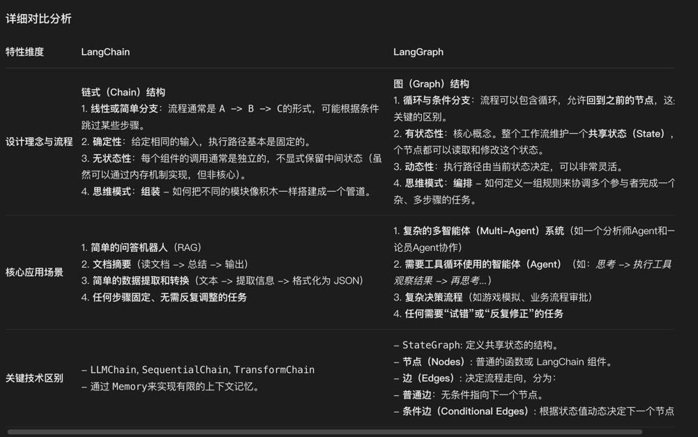

## langChain 和 langGraph 

LangChain: 一个用于构建链式（Chain） AI 应用的框架。它专注于将多个组件（如模型、提示模板、工具）以确定的、线性的或简单分支的方式连接起来，形成一个可执行的序列。它的思维模式是“组装”
LangGraph: 一个基于 LangChain 的库，用于构建有状态、循环的多参与者（Agent）工作流。它将这些组件视为图中的节点，并通过边来控制复杂的执行流程，特别是支持循环（Loop）。它的思维模式是“编排”。

