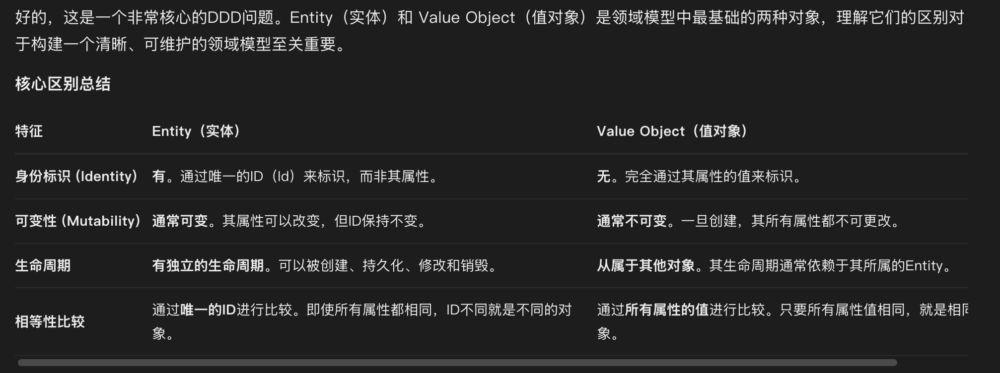

## 云览科技

### 下面的代码会输出什么结果
```go
package main

import "fmt"

func main() {
	arr := []int{1, 2, 3}
	for i := range arr {
		go fmt.Println(i)    // 启动携程执行，但是主携程退出了，子携程会快速退出，可能还来不及执行
		defer fmt.Println(i)  // 串行执行，栈的方式，LIFO
	}
}
```
可能的输出结果是：2 1 0

首先分析 for i := range arr {} 这里的i是一个index，而非是数组中的值
```go
	for i,v := range arr {  // 这里的i是索引，v是值
	}
```
分析 go fmt.Println(i)，启动携程处理，但是主现场没有等待它 - 就是这里可能执行不到
> 闭包问题出现在使用匿名函数时
> go fmt.Println(i) 是值拷贝

分析 defer fmt.Println(i)，值拷贝，逆序执行 输出 2 1 0
> 方法结束后，单携程串性执行，栈的方式执行


### K8s 相关考点

deployment statefulset 的pod启动方式

deployment pod的启动方式：（rolling update）
```text
pod与pod之间是无序的

先创建一个新pod，再删除一个旧pod  --- 并行的

新Pod启动并就绪后，旧Pod才会被终止

保证服务可用性和无缝更新
```

statefulset 的pod的启动方式：（rolling update）
```text
pod与pod之间是有序的

会按照pod编号的逆序销毁、重建pod -- 流程如下：
先销毁标号为n-1的pod，pod销毁成功后，再创建新的pod，新pod正常启动后，才会执行n-2的pod的操作；直到所有的pod被升级掉

整个过程是串行的，先销毁n-1的编号pod，创建n-1编号的pod，再操作n-2.....再操作编号为0

目的： 保证稳定性和数据安全。同一时刻只有一个 Pod 发生变动，避免两个相同序号的 Pod 同时运行。
  稳定的存储：
  稳定的网络标识：
  有序部署：
```


k8s中，先做一些初始化行为，是怎么做的
```text
init 容器，这个容器只会执行一次，如果执行失败了，会导致目标容器服务失败
```

在k8s中，一个服务需要做一些初始化后才暴露服务，此时有流量进来怎么办？  --- 这里考我的是服务pod的健康检测机制
```text
你服务都还没有启动起来？ 怎么可能对外暴露服务呢？

即便我把服务的域名暴露出去了，在k8s中的pod服务没有启动起来，都没有想名字服务注册，服务访问都到不到服务中来


基于service的方式对外暴露服务（或者滚动更新期间）时，如果没有配置健康检测，service的endpoints会立即将新pod的ip加入（此时的pod可能还没有准备好对外暴露服务）

解决方式： 配置一个就绪检测（健康检测）

```

k8s对外暴露服务的方式有哪些
```text
1、service的方式
    Service 并指定类型来暴露服务： ClusterIp（默认）、NodePort、LoadBalancer、ExternalName

2、ingress 方式暴露HTTP、HTTPS接口
    通过 Ingress 资源暴露 HTTP/HTTPS 服务
```


### kafka 调优


### 量级这么大，有没有遇到性能问题

1、告警服务遇到过内存持续上涨，导致最终pod异常重启的问题
```text
zap 的日志文件没有设置滚动导致文件过大，然后占用系统的buffer过多，导致内存持续上涨，最终pod异常重启

Pod 内存持续上涨              日志文件被持续读取，内容被缓存到 Page Cache             page Cache 被计入 Pod cgroup 内存使用量

最终 Pod 重启                cgroup 内存使用量达到 memory limit，触发 OOM Killer    内核回收缓存的速度跟不上日志增长和缓存产生的速度

多个 Pod 共享 Buffer 缓存     Buffer/Page Cache 是节点级资源                        内核固有设计，旨在提升整体 I/O 性能

Pod 无法自行刷盘              缓存管理权在内核，cgroup 只有消费配额限制权               Pod 是无特权的隔离环境，无法执行系统级缓存释放命令
```

2、对于激增流量，导致服务器的cpu、内存压力大，并告警的处理
```text
收到告警时，迅速定位问题，通过指标监控查看流量激增的起始时间，已经增长趋势
通过日志系统，查看新增的流量信息，比如什么策略、哪个用户等


如果是外部用户，根据其策略信息，看是否配置的合理，不合理的话，导致的大量告警其实用户也不关心，可以通过限流的方式将流量限制住
如果是内部用户，大部分是错误的策略导致，让其删除或者关闭该策略、或者限频
```

### DDD 模式中的 entity 和 value object 的区别
entity(实体类)  value object(值对象)



entity
```text
1、有身份标识，通过唯一的ID来标识
2、通常起属性是可变的，但是ID不变
3、有独立的生命周期、可以被创建、持久化、修改、销毁
4、通过唯一的ID进行相等性比较


实体是那些需要被唯一标识和跟踪的对象。它的身份标识在其整个生命周期内都至关重要，即使它的其他属性发生了变化，我们也知道它“是同一个东西”
比如：
    订单  身份标识：有订单ID 
         可变性：状态的变化（已付款、已发货、已收货）
         比较性： 只要订单ID相同即可表示是同一个订单
    
    用户  身份标识： 用户ID
          可变性：  姓名、密码、头像、昵称等都可以变
          比较性： 只要用户ID相同就表示同一个用户
```

value object
```text
1、没有身份标识，完全通过其属性值来标识
2、通常不可变，一旦创建，其内部的属性值就不会更改
3、从属于其他的entity对象
4、通过所有属性值就行比较

值对象用于描述领域的某个方面，但没有自己的身份标识。它完全由其属性值构成。我们只关心它是什么，而不关心它是谁。
比如：
    Address  身份标识：无
             可变性：地址一旦创建，其属性就不应被修改
             相等性比较： 两个地址对象，只要它们的国家、省、市、街道等属性值完全一样，我们就认为它们是相等的，可以互换
    金额 (Money)
    颜色 (Color)
    坐标 (Coordinate)
    日期范围 (DateRange)
    

```