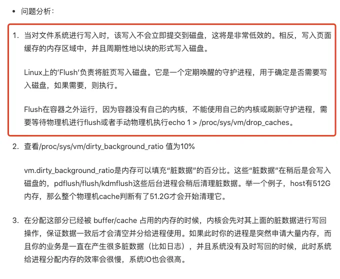

### 升级pvc导致fink任务连接的kafka长连接断开，且重连失败 (网络组原因，导致连接不上)
升级时，需要评估影响范围，主要是考虑对运行中的任务有哪些影响

因为kafka在监控的数据流转中启到了很关键的作用(可以说是核心)，所以需要特别关注kafka的表现状态
```text
1、kafka中的数据量、写入速度、消费速度、数据消费延迟、kafka的连接数、kafka服务的cpu、磁盘、网络io、带宽等信息
2、及时告警
3、客户端与kafka服务端的连接
```

### 容器中的内存因为日志文件增多而高居不下问题排查
通过排查发现：
> 当服务在pod中运行时，随着运行时间的增长，容器的内存存在高居不下的趋势(增长趋势)
> 初步怀疑是服务中内存泄漏导致的，通过pprof排查后，发现业务的内存使用并不高，那就可能是其他的问题了，但是该pod中又只有这一个服务
> 于是猜测可能和日志文件有关
> 为了验证这个问题，于是以50倍的日志输出运行服务，发现pod的内存持续上升，然后内存使用完导致oom后，重启pod -- 可以通过监控查看到
> 于是上面就验证了是日志导致的内存持续增长问题
> 通过在服务配置中添加日志分页滚动，和日志压缩后，--- 重跑服务，内存使用量稳定到一个区间中，不再持续上升，问题解决

排查：
```text
可以通过 free -h 查看内存在哪些地方使用了

total：内存总数；used：已经使用的内存数；free：空闲的内存数；shared：当前已经废弃不用；buff/cache：缓存内存数；

如果内存主要在 buff/cache：缓存内存数; 就需要考虑是不是磁盘io的缓存，导致内存占用过多导致
```

本质原因：是linux中的buffer/cache 刷盘导致的
https://zhuanlan.zhihu.com/p/101258495




### 发布顺序导致的问题
纯后端，多服务直接的发布，需要提前评估好发布顺序， 错误的发布顺序，可能会引入脏数据，或者导致部分不可用的场景

前后端发布时: 如果后端的接口校验，不兼容之前的前端传入的数据时，需要先发布前端，再发布后端  --- 提前评估发布顺序，功能依赖


### 基于canal同步mysql的 binlog到kafka消费，由于上游量多，导致kafka挤压告警

原因：
1、上游数据激增
2、保证数据的顺序性(其实就是一致性数据保障)，单线程处理 -- 存在效率慢的问题
```text
mysql(binlog) -> canal  -> kafka(topic,单分区) -> 同步器(单线程顺序处理) -> gateway-api  -> 入库
```

这种模式存在的弊端:
```text
canal 监听 binlog的 ROW模式，会有大量的数据记录  -- 数据量大
为了保证数据的一致性，又必须使用单topic、单partition，无横向拓展的能力，同时业务不是单纯的db同步，存在业务(网络io等)，使整体慢下来
```

解决方式：
1、启动全量同步（将源库的数据同步到目标库）
2、增量的kafka数据消费能力提升(大部分只需要判断一下版本号即可)，所以处理(TPS)能力大涨，迅速消费完kafka中的数据

拓展
```text
MySQL 的 binlog（二进制日志）有三种记录模式：
 - STATEMENT（基于语句的复制）
 - ROW（基于行的复制）
 - MIXED（混合模式复制）。
 
STATEMENT模式记录执行的SQL 语句，日志文件小但可能导致主从数据不一致；

ROW模式记录每一行数据的实际修改，更安全但日志量大； -- canal 监听 binlog，必须是ROW模式

MIXED模式结合了两者的优点，根据修改内容自动选择记录SQL 语句或行数据
```

优化：
考虑这种方式存在的必要性，是否可以通过接口同步操作，去掉这个中间流程

### 在业务流程成，任务依赖于外部服务系统、中间件系统、或者其他的依赖，都需要设置对应的指标观察，这样才能提前知道系统的问题

### 如果提前预判到可能因为激增流量导致的数据挤压，一定要支持可以横向拓展，解决问题的基础能力，然后再在这个之上优化程序


### 业务中，如果存在手动操作mysql数据时，比如删除、修改数据，需要考虑到数据的量，否则可能存在影响db主从同步延时风险
mysql的主从同步是基于binlog的row模式来的，所以当在主库上面执行sql操作时，如果操作的行比较多，那么会产生大量的binlog记录
对于从库来说就是激增流量，从库处理不过来，导致主从同步延时

操作数据库的时候需要确定影响条数