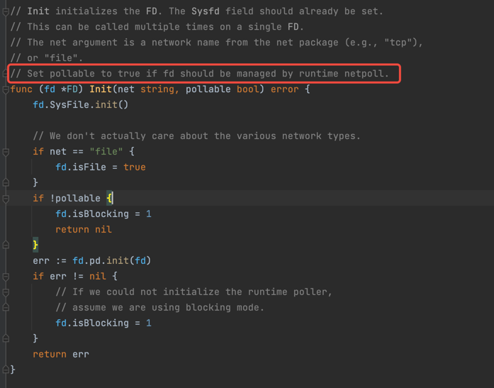
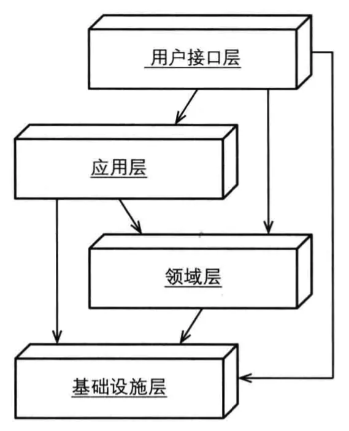

### sync.Pool
减缓gc、用于对象复用
```text
1、用于对象复用，主要针对于生命周期长的且无状态的对象，短生命周期的对象不建议使用sync.Pool
2、最佳实践参考：fmt中的pp使用sync.Pool达到复用pp对象
3、通过sync.Pool的Get方法的描述信息可知：Get获取到的对象，可能是pool中的对象也可能是New出来的对象；put和get的对象不能有依赖(无状态对象)
    - 但可以在每次new出来之后往对象中设置基础值(大家共用的)
```

### zap 需要了解一下，rpc-go的log就是包装的zap logger --- 需要找一个样例
https://pkg.go.dev/go.uber.org/zap#pkg-functions

一个强大的日志输出框架，very fast

提供了两种日志对象：logger 和 SugaredLogger ；
```text
logger : faster、strongly typed(强类型) and inexpensive
SugaredLogger: 相对于logger会慢一些、loosely typed(弱类型)、simple
```

zap创建logger对象的方式：
```text
Simple: 直接通过内置的方法创建，简单只适用于测试，单测，demo应用
Basic config:  基于config创建
Advance config:  基于config创建
```

Log:
```text
流程: 写入 -> 序列化 -> 输出
在序列化可以动态改变或者自定义: 比如 json,fmt等等
输出(sink):  控制台、file、kafka、other 等等
```


### uuid 生成
github.com/google/uuid 生成uuid
```go
import (
"fmt"
"github.com/google/uuid"
"testing"
)

func TestUuid(t *testing.T) {
    newUUID, err := uuid.NewUUID()
    if err != nil {
		fmt.Println(err)
        return
    }
    fmt.Println(newUUID.String())
}
```

### K8s中服务的销毁重建，镜像版本升级是怎么停止程序的
当k8s中的pod销毁重建时(重建pod、镜像升级、版本回退等等)，pod会向里面的所有容器发送unix.sigTerminal指令，用户的应用程序应该需要监听该指令进行应用程序的优雅退出

在golang中、如果程序有内存级别的channel消费，那么这个channel里面的数据会丢失吗？
> 如果业务没有实现goroutine的安全退出，那么就会丢失数据


### rpc中如何进行优雅退出的？
这里需要弄清楚在程序退出时，哪些资源需要退出，比如在rpc中有：server、service(rpc\http),net.listener、net.conn等等

关系信息：
```text
server 下有 多个service；每个service都会监听一个端口(net.listener)

监听的端口(net.listener),有链接建立的时候，就会新建一个net.conn (当然如果是相同的src可以复用tcp连接)

net.conn 有空闲时间、keepalive、等参数 -- 底层都会复用连接的，毕竟创建连接的成本还是挺大的
```

所以在rpc监听到容器的sigTerminal指令后，需要关闭这些对象
①、执行server的退出函数
②、依次执行service的关闭函数  --- 有超时限制
   关闭service函数做了哪些事情呢？
```text
1、关闭net.listener ，不再接受请求
2、执行context的cancel，关闭所有的连接对象 -- 父context执行了cancel，其所有的子context都会接收到cancel信号
3、这里有一个疑惑，具体的执行业务操作的context不是service的context派生出来的，所以在退出时没有优雅的退出；但因为主线程退出来，这些子线程也会退出
```
③、main函数执行完毕，执行用户应用的defer函数
```text
应用级的defer函数就是用来优雅退出应用的
比如：
 - 不再生产数据(不向内部chan写数据)
 - 关闭内部的chan、但需要等待消费chan的协程处理完毕，通过sync.WaitGroup{}、errgroup 的 wg.wait()实现等待
 - 执行context.cancel通知内部线程
```

### rpc的service是如何监听rpc的连接的

1、底层还是使用的net.listener，但对其包装了一下；然后调用包装的l.accept(),但是底层还是使用的net.listener.accept()

2、监听到请求：请求本质是一个io.reader对象，然后rpc封装的codec会从请求(io.reader)对象中读取字节数组-数据
> ①、读取rpc-header信息，校验里面的魔数、header中有四个字节(32位)用来表示rpc-body的大小，同时也会校验这个body的大小，不能太小和不能超过10m
>
> ②、读取rpc-body信息，通过header中的body长度从io.reader中获取

3、通过service的hander来处理rpc-body信息 — 这里想想也是合理的，只有service才保存了自己所有的handler处理，才可以匹配到这次请求到底请求的是哪一个rpc接口
> ①、通过codec得到msg和context对象
> 
> ②、通过codec将request请求信息封装到msg中；caller的元数据信息，比如超时时间
```text
- 超时时间：service的超时时间、对应rpc接口的超时时间、caller的超时时间，三者取最小；context.WithTimeout(ctx, timeout) 创建出带有超时时间的ctx
- 构造filter-chain；在构造filter-chain的func时，会对应请求体做解压、反序列化操作拿到最终中的body；
1. **压缩**：减少数据大小，提高传输效率，降低带宽消耗，缩短传输时间。
2. **序列化**：将数据结构转换为可传输的格式，使其能够在不同系统之间传输和重建，确保数据完整性和一致性。
```

4、通过codec拿到的msg拿到caller的methodname，从而拿到handler； 然后执行hander


### ants.pool 线程池


### K8s中的服务注册、监听服务
个人理解： k8s在注册服务时，可以设置端口的监听协议，比如tcp、udp；同时还需要设置服务的接收请求协议，比如tcp、http；如果设置成http协议，那么只能通过http协议访问该服务，使用tcp的方式访问该服务就会报错

### K8s的网络学习
同一个node中的不同的docker 容器之间的相互通信，通过veth pair 实现，veth pair可以跨network namespace

### Go并发场景 — 控制与逻辑的分离；开发更多是关心逻辑，控制交给架构(框架、工具)  --需要补全呀 
健壮性考虑：
1、goroutine异常时，比如业务中抛出panic，goroutine 没有对panic处理会导致整个业务异常退出
2、goroutine的链路追踪问题，如何定位goroutine的执行情况
3、goroutine参数问题，比如context信息，request scope param 透传等信息

可读性问题：
我们往往写goroutine的时候会在业务中夹杂着大量的控制的代码，这样会导致控制与逻辑没有分离，从而导致阅读代码的人分不清楚逻辑信息
《《所有的软件架构、设计模式解决的根本问题在于控制和逻辑的分离。我们不希望加重开发者的负担，而是更多的聚焦在业务逻辑上》》

```text
errgroup 是golang提供的工具，可以对goroutine进行管理，
比如
 - the number limit active goroutine in a group
 - err handle
 - context.cancel 当通过带有context的方式创建errgroup，那么当第一次遇到err时，就会执行context.cancel，就可以快速失败其他的任务
 
golang.org/x/sync/errgroup
```

工作流的解决方案：
比如在一些场景下，需要解决类似于流水线一样的工作的任务，比如 执行 A, B依赖于A执行的结果，C依赖于B执行的结果 等等，这种流水线的任务
监控中有这样的场景吗？
cmdb：cmdb只是定时的拉取各个产品侧的数据，然后于数据库中的数据比较，最后将变更数据转换成列式存储


### golang 枚举值生成器
```go
//go:generate enumer -type=A -trimprefix=A -values -output x_enumer_A.go
type A int

const (
	ShieldTimeTypeInvalid A = 0
	ShieldTimeTypeForever A = 1
	ShieldTimeTypeAbsolute A = 2
	ShieldTimeTypeLoop A = 3
)
```
执行
```shell
 go install git.woa.com/tcop-team/tools/enumer@v1.6.2
 go generate .
```

### 开发应用服务的时候，需要考虑横向拓展 -- 简单的增加集群能提高效率的那种
地域、多set、路由等方面考虑


### 服务的qps，高并发处理

告警检测
> 做告警检测服务，通过flink计算后的指标数据，匹配告警策略做告警检查

量级：
策略：七百万条
   gz 50万

规则：千万级别

绑定的实例： 千万级别的

部署模式
```text
pod资源: 16核、32G

分地域分产品：kafka 数据   -- 这个结论怎么得到的，就是哪些地域下的哪些产品上报数据量大？ 因为产品本身都是分地域的，所以不同的地域下的产品实例个数是能有明确的知道的；
    比如：a地域下的 产品a销售比较好，卖出了10万台，但是产品b就只卖出了100台，所以针对于地域a下的产品a单独开出一条处理链路处理， 上报(采集) -> 网关 -> kafka -> flink -> kafka -> (告警检查/指标存储)

分地域分产品部署的好处：
1、避免数据堆积导致数据处理实时性下降
2、更好的拓展，比如某地域的某产品量增了，可以在对应的下游业务处理，横向拓展pod处理(考虑kafka重平衡带来的问题)
3、比如某个地域下线了，可以快速的下线下游业务，而不是耦合再一起，导致资源的浪费

```

每日检查的量级：1.7 ~ 2.3亿的量级调用告警发送服务
大地域: gz 五千万  sh 四千万 等等
```text
平均的qps: 900
最大的qps: 2778 
```


告警通知
> 告警通知在接受如此大量的请求，内部是如何处理高并发的？

800万 - 900万 每小时
2500 qps 均值

部署架构
```text
api
8核16g 共 10 pod

干两件事件：
1、数据转换 
2、异步调用真正干活的服务
    异步调用
    针对部分，进行同步调用 （触发和恢复间隔时间比较短的时候，将其路由到同步调用链路上）
        虽说是同步，底层还是通过ants.pool异步处理，只不过这个异步会现在并发度罢了，不是纯同步操作  --- 主要是为了保证执行效率
        
```

干活的服务：

部署架构
```text
灰度 2核4G 8pod
生产 4核8G 15pod

pipeline 处理模式，一个goroutine处理到死；内部的一些扩展操作用到了goroutine并发

就操作es的时候，使用了异步操作，其他的都是一个goroutine执行到死


这里的高并发，主要还是靠的rpc中的net.listener 架构

接受者
执行者 -- ants.pool

```

### rpc 架构的高并发

一个server 对应多个service，每个service都是一个业务服务，监听一个端口
> net.Listener

高并发设计:
```text
1、通过 net.Listener 监听指定端口上的连接
2、if tcpConn, ok := rwc.(*net.TCPConn); ok {} 开启keepAlive 和 设置 keepAlivePeriod
3、包装一个业务连接对象：包含 原始连接、源ip、目标ip、线程池、FramerBuilder(这个用来解析请求的) 等等
4、源ip和业务连接对象的map映射  主要是复用连接，表示相同的源ip的连接，一个就好
5、异步启动连接的服务 -- 使用异步的方式处理连接上面的请求
      ①、前置检测
      ②、空闲时间检测
      ③、req, err := c.fr.ReadFrame() 读取连接中的请求信息
      ④、同步 或者 异步处理(线程池处理)请求
      
这里主要还是依赖于go的 net.Listener 的conn 的epoll处理吧 -- pollDesc \ netpoll
```

### ants.pool func的场景
```go
func createRoutinePool(size int) *ants.PoolWithFunc {
	if size <= 0 {
		size = math.MaxInt32
	}
	pool, err := ants.NewPoolWithFunc(size, func(args interface{}) {
		param, ok := args.(*handleParam)
		if !ok {
			log.Tracef("routine pool args type error, shouldn't happen!")
			return
		}
		// ants.pool的延时处理时间，需要监控
		report.TCPServerAsyncGoroutineScheduleDelay.Set(float64(time.Since(param.start).Microseconds()))
		if param.c == nil {
			log.Tracef("routine pool tcpconn is nil, shouldn't happen!")
			return
		}
		param.c.handleSync(param.req)
		// 重置，方便复用
		param.reset()
		// 放回sync.pool中，复用
		handleParamPool.Put(param)
	})
	if err != nil {
		log.Tracef("routine pool create error:%v", err)
		return nil
	}
	return pool
}
```


### sync.pool的使用场景
1、wrapper场景
```go
args := handleParamPool.Get().(*handleParam)
	args.req = req
	args.c = c
	args.start = time.Now()
```

2、buffer场景


### go 中的网络处理模型 epoll

主要需要理解到：当net.listener监听client连接后，创建的FD，这个FD在有数据，和没有数据的时候，是怎么处理的？？？

关键还是得看net包的实现

net中的网络模型使用的epoll --> 通过netpoll来实现的


#### net.listener
net.Linsten总结有以下几个步骤：

一些前置工作

系统调用来创建socket

绑定端口

开启监听

尝试初始化 netpoll  

将socket fd加入到监听中

```go
func (pd *pollDesc) init(fd *FD) error {
   // serverInit是一个sync.Once类型变量，因此全局只会调用runtime_pollServerInit进行一次初始化
   // runtime_pollServerInit通过golink链接到/runtime/netpoll.go中的poll_runtime_pollServerInit()函数
   // 在poll_runtime_pollServerInit()中完成netpoll的初始化
   serverInit.Do(runtime_pollServerInit)
   // 使用runtime_pollOpen将当前fd加入到系统监听中
   // runtime_pollOpen通过golink连接到/runtime/netpoll.go中的poll_runtime_pollOpen()函数
   // 在poll_runtime_pollOpen()完成fd的监听
   ctx, errno := runtime_pollOpen(uintptr(fd.Sysfd))
	if errno != 0 {
		return errnoErr(syscall.Errno(errno))
	}
	pd.runtimeCtx = ctx
	return nil
}
```
src/runtime/netpoll.go   poll_runtime_pollServerInit
src/runtime/netpoll.go   poll_runtime_pollOpen


看看poll_runtime_pollServerInit()和poll_runtime_pollOpen()

```go
//go:linkname poll_runtime_pollServerInit internal/poll.runtime_pollServerInit
func poll_runtime_pollServerInit() {
	netpollGenericInit()
}

func netpollGenericInit() {
	if netpollInited.Load() == 0 {
		lockInit(&netpollInitLock, lockRankNetpollInit)
		lock(&netpollInitLock)
		// 上锁后的double check，经典手法
		if netpollInited.Load() == 0 {
			// 执行netpollinit进行网络轮询器初始化
			netpollinit()
			netpollInited.Store(1)
		}
		unlock(&netpollInitLock)
	}
}


func poll_runtime_pollOpen(fd uintptr) (*pollDesc, int) {
      // 获取pollDesc
      pd := pollcache.alloc()
      // ...省略代码
      // 调用netpollopen将fd加入到监听中
      errno := netpollopen(fd, pd)
      if errno != 0 {
      pollcache.free(pd)
      return nil, int(errno)
      }
      return pd, 0
      }
      
      // Linux上的netpollopen实现
      func netpollopen(fd uintptr, pd *pollDesc) uintptr {
      var ev syscall.EpollEvent
      ev.Events = syscall.EPOLLIN | syscall.EPOLLOUT | syscall.EPOLLRDHUP | syscall.EPOLLET
      tp := taggedPointerPack(unsafe.Pointer(pd), pd.fdseq.Load())
      *(*taggedPointer)(unsafe.Pointer(&ev.Data)) = tp
      // 进行系统调用syscall.EPOLL_CTL_DEL，将fd加入监听  linux下叫epoll macos下叫kqueue
      return syscall.EpollCtl(epfd, syscall.EPOLL_CTL_ADD, int32(fd), &ev)
}


```


#### net.listener -> listener.access() 中监听客户端连接，并将生成的连接FD初始化，通过netpoll管理
```text

总结，Accept()的工作主要有以下：

一些前置工作

在FD.Accept()中会进行系统调用accept()获取新的客户端连接

如果成功获取到客户端的fd，则新建一个netFD，然后执行netFD的初始化，并将fd加入监听

否则会调用pollDesc.waitRead()挂起当前goroutine，等待被唤醒后重新获取客户端的fd。
```




```go
// Init initializes the FD. The Sysfd field should already be set.
// This can be called multiple times on a single FD.
// The net argument is a network name from the net package (e.g., "tcp"),
// or "file".
// Set pollable to true if fd should be managed by runtime netpoll.
func (fd *FD) Init(net string, pollable bool) error {
	fd.SysFile.init()

	// We don't actually care about the various network types.
	if net == "file" {
		fd.isFile = true
	}
	if !pollable {
		fd.isBlocking = 1
		return nil
	}
	err := fd.pd.init(fd)
	if err != nil {
		// If we could not initialize the runtime poller,
		// assume we are using blocking mode.
		fd.isBlocking = 1
	}
	return err
}
```

#### read && write
```text
Read和Write的流程基本相同，都是使用系统调用进行Read和Write，如果不可读、不可写，则使用pollDesc.waitRead()将当前goroutine挂起。
```

#### 如何唤醒休眠中的goroutine？
通过调用netpoll()函数会得到一批可读、可写的goroutine
```text
// netpoll checks for ready network connections.
// Returns list of goroutines that become runnable.
// delay < 0: blocks indefinitely
// delay == 0: does not block, just polls
// delay > 0: block for up to that many nanoseconds
// 返回一个runnable的goroutine列表
func netpoll(delay int64) gList {
	if epfd == -1 {
		return gList{}
	}
	// ...进行一些秒数转换
retry:
	// 系统调用epollwait向内核查询是否有事件发生
	n, errno := syscall.EpollWait(epfd, events[:], int32(len(events)), waitms)
	if errno != 0 {
		if errno != _EINTR {
			println("runtime: epollwait on fd", epfd, "failed with", errno)
			throw("runtime: netpoll failed")
		}
		// If a timed sleep was interrupted, just return to
		// recalculate how long we should sleep now.
		if waitms > 0 {
			return gList{}
		}
		// 返回EINTR,说明epollwait被操作系统信号打断了，要重试
		goto retry
	}
	// 定义一个gList类型变量用来存储可运行的goroutine地址
	var toRun gList
	for i := int32(0); i < n; i++ {
		// 已经找到n个可返回的goroutine
		ev := events[i]
		if ev.Events == 0 {
			continue
		}

		// 判断是否是被管道发来的数据而打断(在netpoll初始化时会创建一个管道用来发送信号打断netpoll)
		if *(**uintptr)(unsafe.Pointer(&ev.Data)) == &netpollBreakRd {
			if ev.Events != syscall.EPOLLIN {
				println("runtime: netpoll: break fd ready for", ev.Events)
				throw("runtime: netpoll: break fd ready for something unexpected")
			}
			if delay != 0 {
				// netpollBreak could be picked up by a
				// nonblocking poll. Only read the byte
				// if blocking.
				var tmp [16]byte
				read(int32(netpollBreakRd), noescape(unsafe.Pointer(&tmp[0])), int32(len(tmp)))
				netpollWakeSig.Store(0)
			}
			continue
		}

		var mode int32
		if ev.Events&(syscall.EPOLLIN|syscall.EPOLLRDHUP|syscall.EPOLLHUP|syscall.EPOLLERR) != 0 {
			// 读事件
			mode += 'r'
		}
		if ev.Events&(syscall.EPOLLOUT|syscall.EPOLLHUP|syscall.EPOLLERR) != 0 {
			// 写事件
			mode += 'w'
		}
		if mode != 0 {
			tp := *(*taggedPointer)(unsafe.Pointer(&ev.Data))
			// 获取返回fd对应的pd结构
			pd := (*pollDesc)(tp.pointer())
			tag := tp.tag()
			if pd.fdseq.Load() == tag {
				pd.setEventErr(ev.Events == syscall.EPOLLERR, tag)
				// 调用netpollready处理，在netpollready中将对应fd等待读写的goroutine放入toRun链表中
				netpollready(&toRun, pd, mode)
			}
		}
	}
	// 到这里toRun里面已经全都是可以执行的goroutine了
	// 注意这里goroutine的状态仍然_Gwaiting，要由调用方将状态改为_Grunnable，等待调度执行
	return toRun
}

继续进入核心函数netpollready()中。

// 获取pd关联的协程地址，放入toRun中
func netpollready(toRun *gList, pd *pollDesc, mode int32) {
	var rg, wg *g
	if mode == 'r' || mode == 'r'+'w' {
		rg = netpollunblock(pd, 'r', true)
	}
	if mode == 'w' || mode == 'r'+'w' {
		wg = netpollunblock(pd, 'w', true)
	}
	// 加入到toRun列表中
	if rg != nil {
		toRun.push(rg)
	}
	if wg != nil {
		toRun.push(wg)
	}
}

func netpollunblock(pd *pollDesc, mode int32, ioready bool) *g {
	// 获取rg或者wg
	gpp := &pd.rg
	if mode == 'w' {
		gpp = &pd.wg
	}

	for {
		old := gpp.Load()
		if old == pdReady {
			// 说明这个pd的状态已经是pdReady，其对应的goroutine不再需要唤醒
			return nil
		}
		if old == pdNil && !ioready {
			// Only set pdReady for ioready. runtime_pollWait
			// will check for timeout/cancel before waiting.
			return nil
		}
		var new uintptr
		if ioready {
			new = pdReady
		}
		// 将pd.rg或者wg设置为pdReady状态
		if gpp.CompareAndSwap(old, new) {
			if old == pdWait {
				old = pdNil
			}
			// 返回对应的goroutine地址
			return (*g)(unsafe.Pointer(old))
		}
	}
}
```

最后，再来看下netpoll()被调用的地方，可以看到在/runtime/proc.go中的findRunnable()函数有被调用(当然还有其他地方，这里不叙述了)，
而findRunnable()函数正是GMP模型中，
M寻找可执行G的函数，如果netpoll()成功返回一批goroutine，
那么会将这批goroutine的状态从_Gwaiting改为_Grunnable，然后进行调度执行。


总结:
```text
net.Listen()会创建socket，尝试初始化netpoll，然后将socket fd加入到监听中

Listen.Accept()会尝试获取新的客户端连接fd，如果成功获取就将fd加入到监听中，否则挂起当前goroutine

Conn.Read()和Conn.Write()会尝试读取/写入fd，如果成功就将数据/结果返回，否则挂起当前goroutine

Linux通过epoll机制将可读/可写的fd通知给用户程序，程序通过在GMP调度器中调用netpoll()来获取一批可运行的goroutine，然后进行调度执行
```

### gorm  会用就行
会使用就行，不会用时参考一下文档

### gin   -- 这些都是业务无关的，可以后面再深入了解
https://juejin.cn/post/7263858148276142135

https://www.luozhiyun.com/archives/561

https://www.luozhiyun.com/

### 监控指标
黄金指标: 请求错误量、请求响应时间、请求成功量

网络的监控:
```text
错误计数器，错误发生的次数及错误码；

重试计数器，重试批次发生的次数；

超时计数器，超时批次发生的次数；

消息计数器，发送的日志数及结果；

连接更新计数器，连接负载均衡的次数及原因；   --- 重要

排队消息计数器，worker中当前排队的消息数量；   --- 重要

批次大小，每个批次的字节数；     --- 重要

批次时延，每个批次的发送时延。    ---  重要
```

### 需要研究的东西
https://github.com/apache/inlong/tree/master/inlong-sdk/dataproxy-sdk-twins/dataproxy-sdk-golang

https://github.com/panjf2000/gnet

https://strikefreedom.top/archives/go-event-loop-networking-library-gnet
```text
快速开发原型验证可行性；

提供极简的接口；

生产者/消费者模型是一个行之有效的模型，创建多个消费者（工作者），与服务器建立多个管道，充分利用多核CPU的能力进行并发处理，在单个管道内部，尽可能批量、压缩传输，减少IO消耗；

根据服务特点开发服务发现客户端，小心处理服务节点更新事件；

你可能需要一个定制的连接池；

在Go语言里，异步转同步非常容易，必要时可以提供同步方法给用户；

一个事件驱动的异步网络库可以极大的帮助你处理并发和异步逻辑；

小心处理所有异步逻辑，遵守一些异步处理的原则，可以减少犯错的可能；

负载均衡很重要，但要避免过于复杂；

性能优化无止境，但也有一些通用的原则；

提供默认配置，也提供灵活的配置接口；

提供监控指标和调试日志；

认真面对测试中遇到的问题；

开源代码也有bug；

遵守代码规范；

复杂的的事情无法一蹴而就，需要长时间的调试优化。
```

### set化

当服务 100w 在线的时候，一个服务单节点可以提供服务；
当服务到 500w 在线的时候，一个服务多个节点可以提供服务；
当服务 5000w 在线的时候，就要考虑进行拆分，否则一个服务有问题，会影响所有用户的访问。


SET（Service Elastic Unit）即服务弹性单元，指能独立完成特定分区所有业务操作的自包含集合，包含所需业务服务和数据分片
高可用： 业务上， 架构上(set化)

set化是一种在架构上解决高可用的一种方式
> SET化是一种常用的解决系统可用性的方法
```text
SET化指的是对系统进行SET维度部署，每一个SET之间相互独立，互不干扰。当系统出现可用性问题时，可以通过控制爆炸影响范围，从而降低系统故障对业务的影响。本质上，SET化架构是为了解决单点问题，将系统中的各个部分分离，从而避免单个组件故障导致整个系统不可用的情况。
```

```text
无状态SET：这种类型的SET可以横向扩展，即任意地进行SET的扩缩容操作。这类业务没有复杂的设计诉求，只需要进行多园区容灾部署，就可以达到一定的可用性诉求。

有状态SET：这类SET相对复杂，这类业务往往具备一定的生命周期，有的是短周期，有的是长周期，也有的带存储，也有的不带存储。有状态SET在设计时需要注意数据的持久性和一致性，以便在扩缩容过程中保持业务的正常运行。

带存储的有状态SET：这类SET除了具备有状态SET的特点外，还带有存储资源。因此，在设计这类业务时，需要同时考虑存储资源的分配和管理，以确保业务在运行过程中的稳定性和性能。
```

set化在架构层面，可以分为横向和纵向
> 横向：多服务，多db存在，db之间需要相互同步数据，即db是副本方式，维护多份 --- 这里也就引申出了数据一致性问题
> 纵向：多服务，单db(db分片)，不会有冗余的副本数据(也就是不存在数据不一致的情况)， --- 这里也会引入一致性hash处理，比如新增、减少分片时，只会影响部分分片数据，而不是全量

数据分片策略：
   横向切分（全量复制）：用于非关键数据
   纵向切分（分片存储）：处理事务性/强一致性数据


在选择横向还是纵向划分时，需要根据业务需求和数据重要性来权衡利弊。
 - 对于关键数据，建议采用纵向划分方式，以实现更高的可靠性和安全性。
 - 而对于非关键数据，则可以采用横向划分方式，以实现更高的存储效率和数据恢复能力。


路由因子：
> 路由因子，用于决定请求被路由到哪个set中
```text
最常用的唯一字段：在无状态SET下，路由因子可以使用最常用的唯一字段进行处理。例如，在用户信息SET中，可以使用用户ID作为路由因子；在商品信息SET中，可以使用商品ID作为路由因子。这种方法简单易实现，但可能会导致数据分布不均匀，从而影响系统的性能。

内部状态的唯一键：在有些状态SET内，需要依据内部状态的唯一键进行参考。例如，在订单信息SET中，可以使用订单号作为路由因子；在用户订单信息SET中，可以使用用户ID和订单号作为路由因子。这种方法能够保证数据的一致性和可用性，但可能会导致路由因子过长，从而影响系统的性能。

随机分配：在一些情况下，我们可以使用随机分配作为路由因子。这种方法简单易实现，且能够保证数据的分布均匀性。但需要注意的是，随机分配可能会导致数据冲突，从而影响系统的可用性和一致性。

稳定hash：在一些情况下，我们可以使用稳定hash作为路由因子。这种方法能够保证数据的分布均匀性，且能够避免数据冲突。但需要注意的是，稳定hash算法的性能可能会受到哈希冲突的影响，从而影响系统的性能。
```

### DDD领域开发模式
https://learn.microsoft.com/en-us/dotnet/architecture/microservices/microservice-ddd-cqrs-patterns/ddd-oriented-microservice



DDD开发模式，主要是突出了领域的概念，将自己的核心内聚到自己的领域层，外界在组合功能
```text
用户接口层： 用于外部用户访问，web、api、等
应用层： 接收用户接口层的调用，组合领域层实现逻辑； 同时关注事务、日志、鉴权等切面信息
领域层： 接受应用层的调用，关注与自身功能内聚
基础设施层：
```

DDD映射到业务开发中
参考：[The Clean Architecture](https://blog.cleancoder.com/uncle-bob/2012/08/13/the-clean-architecture.html):

这里的重点在于不同层级的依赖方向，即外环层级只能依赖内环层级。
> 需要有明确的依赖关系，禁止出现循环依赖的场景

领域层：
  entities 和 usecase 层，entities 关注通用的entity实体，即实体相关的转换、db等业务操作； usecase 关注于领域的业务
```text
entity: 业务实体层. 内含多个业务实体的定义模块，需要确保同一概念在此处只有一个定义，不要有镜像结构体，实体之间的引用使用ID关联
usercase: 核心用例层.内含业务核心逻辑，含接口的定义
pkg: 不与具体某个特定场景耦合的复用模块，提供的能力的抽象封装；可存放基础设施模块
protocol: 存放协议文件，如Protobuf
```

应用层：
```text
interfaceadapter: 接口适配层.
    ├── repoimpl: 外部依赖(如存储，第三方服务等)的具体实现，如metric/log/tracing就属于公共基础模块
    └── controller: 约等于一般微服务的service等，非必需，若实体仅关注单一用例也可依赖用例(usercase)
```


### 分布式周期性作业执行器
分布式周期性作业执行器. 其功能用于按照一定的周期间隔（如1分钟、5分钟）生成周期事件，将其进行分发处理，并包含一定的错误、超时重试机制.