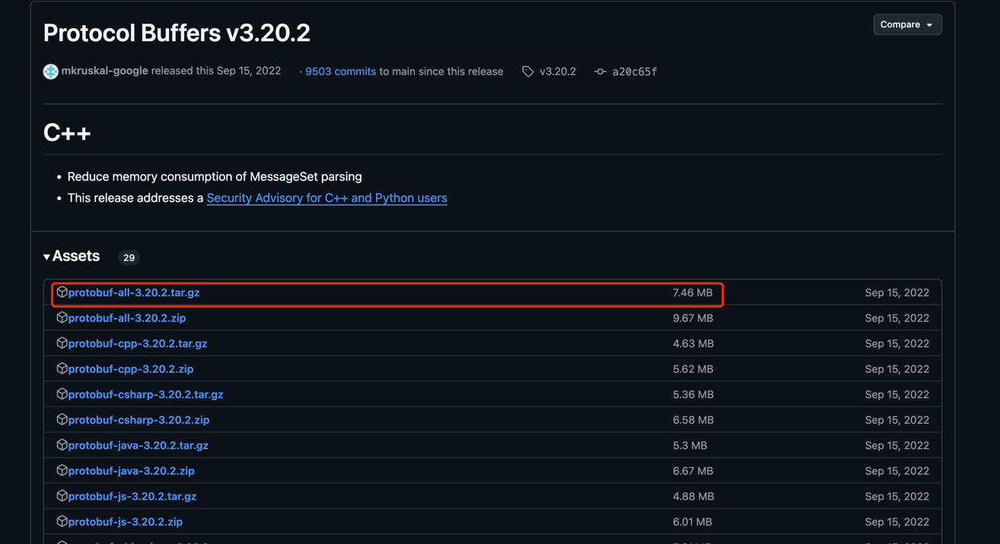

# protobuf中遇到的问题


## 高版本的protobuf在生产go代码时，会导致某些依赖找不到 --- 也有可能是proto版本不对导致，看官网有proto2和proto3
所以需要安装低版本的protobuf

protobuf的安装方式

### macos 通过brew的方式安装
通过brew的方式安装，每次都是安装的最新版本，可能会有高版本的问题
```text
brew install protobuf

## 也可以安装指定的版本，但是很多低版本都不支持
brew install protobuf@<version>
```

### macos 通过下载源码的方式安装
https://github.com/protocolbuffers/protobuf/releases/tag/v3.20.2


将源码下载到本地后，先解压
```text
tar -zxvf protobuf-all-3.20.2.tar.gz
cd protobuf-3.20.2
```

指定安装路径，并执行检查 因为我是非root用户安装的，所有不能访问/usr下的目录，改成了自己用户下的目录
```text
./configure --prefix=/Users/yongzzhao/tools/tool/protobuf-install

make

make install

(或者 make && make install)

如何安装过程中出现错误，判断是不是因为访问了/usr的目录，如果是，需要自己手动创建目录，通过sudo创建
操作后，需要 make clean 后再执行make && make install
```

安装后，(可能还是会下载报错、没事),现在设置环境变量

```text
vim ~/.bash_profile  添加如下信息

export PROTOBUF=/Users/yongzzhao/tools/tool/protobuf-install
export PATH=$PROTOBUF/bin:$PATH

然后让其生效
source ~/.bash_profile

通过protoc --version 判断是否安装成功
```


