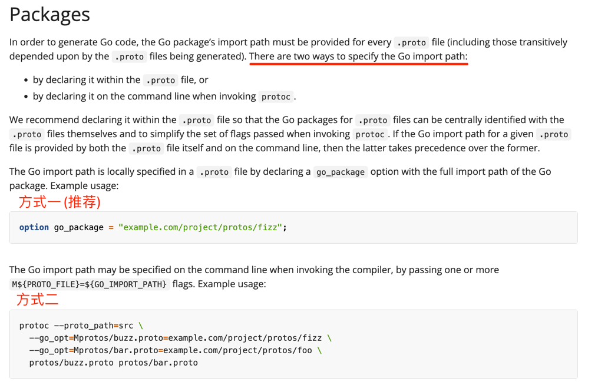

## 一、生成protoc-gen-go代码
1、安装go插件
```text
go install google.golang.org/protobuf/cmd/protoc-gen-go@latest
```
2、到generated_code目录执行protoc命令
```text
protoc --proto_path=proto --go_out=services --go_opt=paths=source_relative managerService.proto
```
可能会得到如下错误:
```text
protoc-gen-go: unable to determine Go import path for "managerService.proto"

Please specify either:
        • a "go_package" option in the .proto source file, or
        • a "M" argument on the command line.

See https://protobuf.dev/reference/go/go-generated#package for more information.
```

需要在proto文件中，指定go_package
```text
option go_package = "protobuf/usecase/generated_code/proto/managerService";

目前我使用的是本地路径，-----不知道会不会有问题 ？？
```
成功执行后，会在相对路径的services（需要自己手动创建）下生成managerService.pb.go文件


**注意: 这个命令只会生成pb.go文件，如果proto文件中定义了service rpc信息，不会生成rpc.go文件**