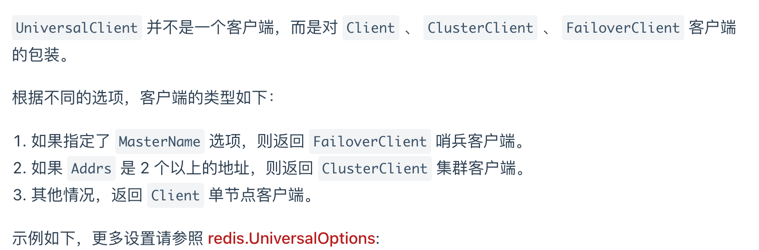

## golang中使用redis
redis是一个基于内存的数据库，所以相对于基于磁盘的数据库访问速度更快
redis常用与作为缓存数据库，对于热点数据，放到redis中访问能提高QPS

### 基于github的go-redis访问redis
[go-redis](https://github.com/redis/go-redis)  
[中文使用文档](https://redis.uptrace.dev/zh/)

#### 使用样例

todo -- 将使用文档中的关键点通过redis-usecase体现
