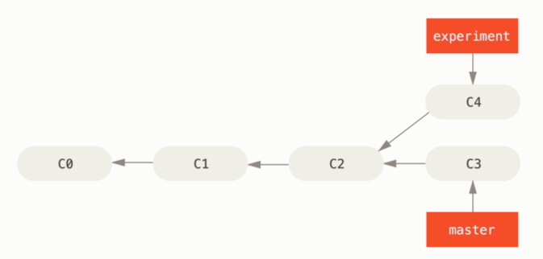
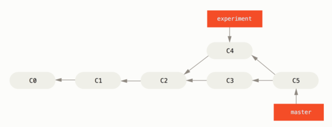
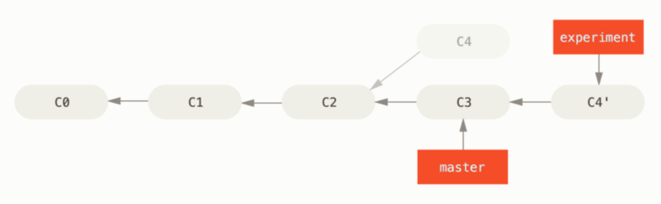
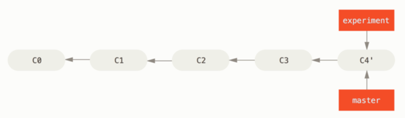

# 变基(rebase) 和 合并(merge)
[变基](https://git-scm.com/book/zh/v2/Git-%E5%88%86%E6%94%AF-%E5%8F%98%E5%9F%BA)

在git中整合不同分支的修改有两种方式：merge 和 rebase






## 合并 - merge
分支master 和分支experiment 都是基于C2提交后，拉出的分支，在之后又各自有提交 <br/>
merge:
就是将 master中的提交C3 和 experiment中的C4 以及他们的共同祖先C2三方合并，合并出一个新的快照(并提交)<br/>

分支: master 和分支 feather_a
现在需要将feather_a合并到master上
```linux
git checkout master
git merge feather_a
```


## 变基 - rebase
在experiment分支上，变基到 master上
```text
$ git checkout experiment
$ git rebase master
First, rewinding head to replay your work on top of it...
Applying: added staged command
```
说白了：变基操作就是，在把当前分支(experiment)的修改，重放一遍修改在目标分支(master)上



然后再通过merge将experiment顺势合并到master
```text
git checkout master
git merge experiment
```


## 拉取数据
```text
git pull --rebase
等价于
git fetch
git rebase origin/master

git pull
等价于
git fetch
git merge origin/master

```

