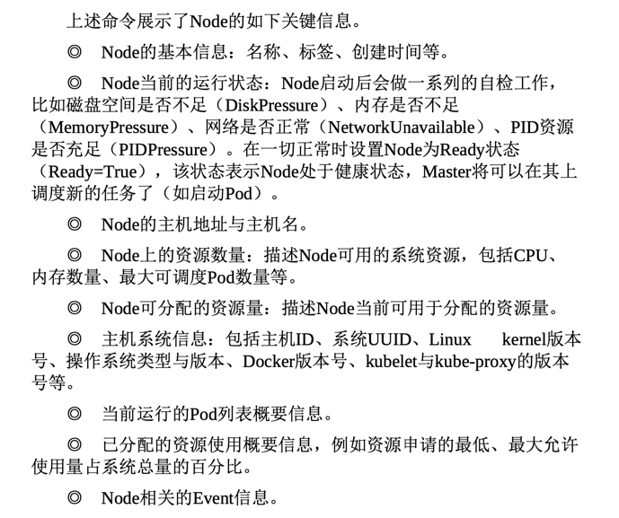
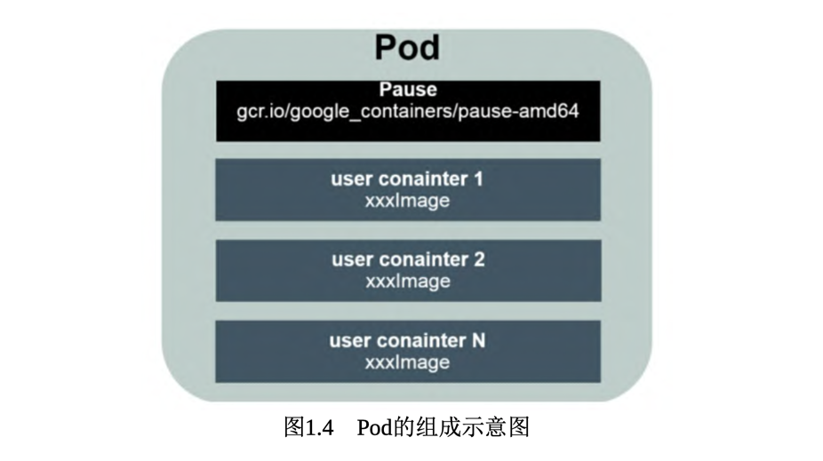
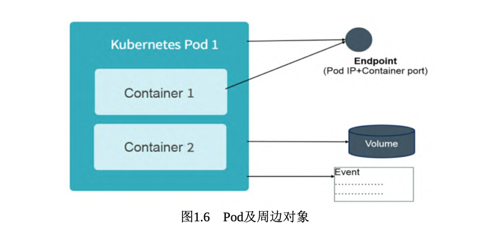

## kubernetes的基本概念和术语
Kubernetes中的大部分概念如Node、Pod、Replication Controller、 Service等都可以被看作一种资源对象，
几乎所有资源对象都可以通过 Kubernetes提供的kubectl工具(或者API编程调用)执行增、删、改、查 等操作并将其保存在etcd中持久化存储。
从这个角度来看，Kubernetes 其实是一个高度自动化的资源控制系统，
它通过跟踪对比etcd库里保存 的“资源期望状态”与当前环境中的“实际资源状态”的差异来实现自动控制和自动纠错的高级功能。

### etcd
```text
etcd 是 Kubernetes 中的一个分布式键值存储系统，主要用于存储和管理集群的配置数据和状态信息。其主要作用包括：
1. **配置存储**：etcd 用于保存 Kubernetes 的配置信息，如 Pod、Service、Deployment 等资源的定义。
2. **集群状态管理**：etcd 记录集群的当前状态，确保各个组件可以获取最新的集群信息。
3. **高可用性和一致性**：etcd 通过 Raft 共识算法实现数据的一致性和高可用性，确保即使部分节点失败，数据仍然安全。
4. **服务发现**：Kubernetes 通过 etcd 实现服务发现，组件可以通过查询 etcd 获取其他服务的位置信息。
5. **事件记录**：etcd 可以记录集群中的事件，帮助管理员监控和排查问题。
6. **分布式锁**：etcd 提供分布式锁功能，支持在集群中协调多个组件的操作。
综上所述，etcd 是 Kubernetes 的核心组件之一，负责存储和管理关键信息，确保系统的可靠性和一致性。
```

### Master
Kubernetes里的Master指的是集群控制节点，在每个Kubernetes集群 里都需要有一个Master来负责整个集群的管理和控制，
基本上 Kubernetes的所有控制命令都发给它，它负责具体的执行过程，我们后面执行的所有命令基本都是在Master上运行的。
Master通常会占据一个独立的服务器(高可用部署建议用3台服务器)，主要原因是它太重要了，是整个集群的“首脑”，
如果它宕机或者不可用，那么对集群内容器应用的管理都将失效。

**在master节点上运行的关键进程**
- API-server: 提供了http rest的接口，是kubernetes中所有资源操作，新增、删除、修改、查询的操作唯一入口；也是集群操作的入口进程
- controller manager: 所有资源的自动化控制中心
- scheduler: 负责资源调度(pod的调度)，调度中心
- etcd: 保存和管理集群的配置数据和状态信息

### Node
除了Master，Kubernetes集群中的其他机器被称为Node，在较早的版本中也被称为Minion。
与Master一样，Node可以是一台物理主机，也可以是一台虚拟机。
Node是Kubernetes集群中的工作负载节点，每个Node都会被Master分配一些工作负载(Docker容器)，
当某个Node宕机时，其上的工作负载会被Master自动转移到其他节点上。

**在每个Node上都运行着以下关键进程**
- kubelet：负责pod中的容器创建、启停等任务，同时与master保持密切协助，实现集群管理的基本功能
- kube-proxy：实现Kubernetes Service的通信与负载均衡机制的重要组件。
- Docker engine(Docker)：Docker引擎，负责本机的容器创建和管理工作。

Node可以在运行期间动态的加入到kubernetes集群中，前提是该Node已经安装部署了以上的关键进程；
在默认情况下，kubelet会向master注册自己，这也是kubernetes推荐的node管理方式
一旦node被纳入集群管理范围，那么kubelet就会定时向master汇报自身情况，比如：操作系统、docker版本、cpu情况、内存情况等，
这样master就知道各个node的资源使用情况，就可以实现高效的资源使用负载均衡策略
但是当master迟迟收不到kubelet的上报信息时，master就会将该node标记为not ready状态，然后会触发"工作负载大迁移"的自动流程

```bash
kubuctl get nodes

kubuctl describe node <node-name>
```


### Pod
Pod是Kubernetes最重要的基本概念,每个Pod都有一个特殊的被称为“根容器”的Pause容器。
Pause容器对应的镜像属于Kubernetes平台的一部分，除了Pause容器， 每个Pod还包含一个或多个紧密相关的用户业务容器。


**Pause根容器存在的原因，主要是解决以下两个问题：**
- pod状态问题：在一组容器作为一个单元的情况下，我们难以简单地 对“整体”进行判断及有效地行动；因为一个pod内存在多个容器，那一个容器挂了pod的状态就是不可用状态么？引入业务无关并且不易死亡的Pause容 器作为Pod的根容器，以它的状态代表整个容器组的状态，就简单、巧 妙地解决了这个难题。
- pod内共享ip和volume: Pod里的多个业务容器共享Pause容器的IP，共享Pause容器挂接的Volume，这样既简化了密切关联的业务容器之间的通信问题，也很好地解决了它们之间的文件共享问题

Kubernetes为每个Pod都分配了唯一的IP地址，称之为Pod IP，一个 Pod里的多个容器共享Pod IP地址

**Pod 和 Node的关系图:（重要）**


每个Pod都可以对其能使用的服务器上的计算资源设置限额: (cpu、内存(memory))
```text
cpu: CPU配额为最小单位，用m来表示,比如100M~300M表示的是0.1~0.3核cpu
memory: 单位是内存 字节数
```
在Kubernetes里，一个计算资源进行配额限定时需要设定以下两个参数。
- Requests:该资源的最小申请量，系统必须满足要求
- Limits:该资源最大允许使用的量，不能被突破，当容器试图使用超过这个量的资源时，可能会被Kubernetes“杀掉”并重启

通常，我们会把Requests设置为一个较小的数值，符合容器平时的工作负载情况下的资源需求，而把Limit设置为峰值负载情况下资源占用的最大量



### Label
Label(标签)是Kubernetes系统中另外一个核心概念。
一个Label是一个key=value的键值对，其中key与value由用户自己指定。Label可以被附加到各种资源对象上，例如Node、Pod、Service、RC等，
一个资源对象可以定义任意数量的Label，同一个Label也可以被添加到任意数量的资源对象上。
Label通常在资源对象定义时确定，也可以在对象创建后动态添加或者删除。

我们可以通过给指定的资源对象捆绑一个或多个不同的Label来实 现多维度的资源分组管理功能，以便灵活、方便地进行资源分配、调 度、配置、部署等管理工作

```text
Label相当于我们熟悉的“标签”。给某个资源对象定义一个Label，就相当于给它打了一个标签，
随后可以通过Label Selector(标签选择器)查询和筛选拥有某些Label的资源对象，
Kubernetes通过这种方式实现了类似SQL的简单又通用的对象查询机制。

label selector提供了两种筛选方式: 基于等式和基于集合
- 等式: = 、!=
- 集合: in 、not in
```
```yaml
selector:
  matchLabels:
    app: myweb
  matchExpressions:
    - {key: app ,operator: In, values: [mysql]}
    - {key: environment, operator: notIn, values: [dev]}

```
如果matchLabels和matchExpressions同时存在时，他们是And的关系

**label selector在kubernetes中的重要使用场景:**
- kube-controller进程通过在资源对象RC上定义的Label Selector 来筛选要监控的Pod副本数量，使Pod副本数量始终符合预期设定的全自 动控制流程。
- kube-proxy进程通过Service的Label Selector来选择对应的Pod， 自动建立每个Service到对应Pod的请求转发路由表，从而实现Service的 智能负载均衡机制
- 通过对某些Node定义特定的Label，并且在Pod定义文件中使用 NodeSelector这种标签调度策略，kube-scheduler进程可以实现Pod定向调 度的特性。


### Replication Controller 简称RC
RC是Kubernetes系统中的核心概念之一，简单来说，它其实定义了 一个期望的场景，即声明某种Pod的副本数量在任意时刻都符合某个预期值，
所以RC的定义包括如下几个部分。
- Pod期待的副本数量
- 用于筛选目标Pod的Label Selector
- 当Pod的副本数量小于预期数量时，用于创建新Pod的Pod模板 (template)。

label selector 的使用:
- Replication Controller: 基于 label selector 的equal,等值比较
- ReplicaSet: 基于label selector 的set：集合比较


一般不会单独使用ReplicaSet类型，因为它一般被Deployment使用，从而形成一整套Pod创建、删除、更新的 编排机制

总结一下RC(Replica Set)的一些特性与作用。
- 在大多数情况下，我们通过定义一个RC实现Pod的创建及副本数量的自动控制。
- 在RC里包括完整的Pod定义模板。
- RC通过Label Selector机制实现对Pod副本的自动控制
- 通过改变RC里的Pod副本数量，可以实现Pod的扩容或缩容
- 通过改变RC里Pod模板中的镜像版本，可以实现Pod的滚动升级。


### Deployment
Deployment是Kubernetes在1.2版本中引入的新概念，用于更好地解 决Pod的编排问题。为此，Deployment在内部使用了Replica Set来实现目的，
无论从Deployment的作用与目的、YAML定义，还是从它的具体命 令行操作来看，我们都可以把它看作RC的一次升级，两者的相似度超过90%。

Deployment相对于RC的一个最大升级是我们可以随时知道当前 Pod“部署”的进度。