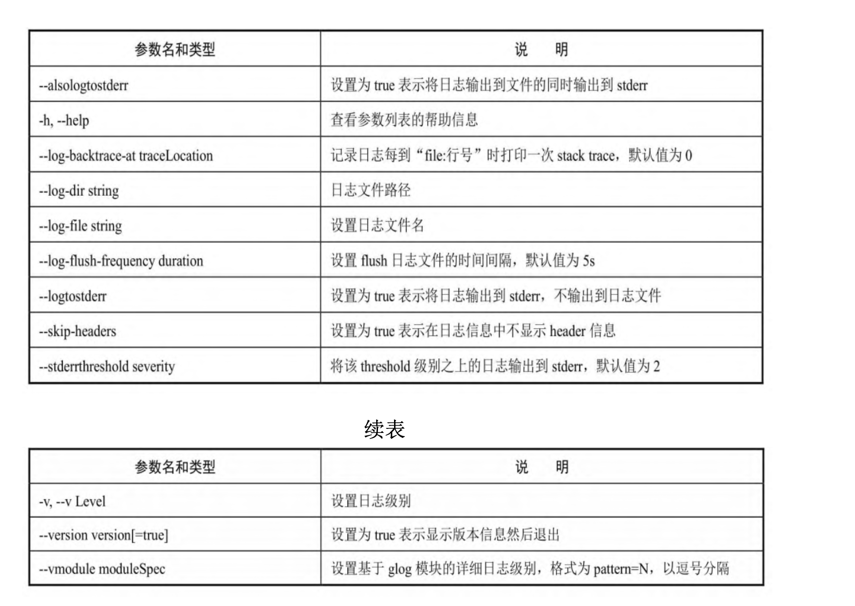

## kubernetes 核心服务配置详解

### 公共配置参数
公共配置参数适用于所有服务:
master:
 - kube-apiserver
 - kube-controller-manager
 - kube-scheduler

node:
 - kubectl
 - kube-proxy

### kube-apiserver启动参数配置 （too much 需要的时候去查文档吧）
