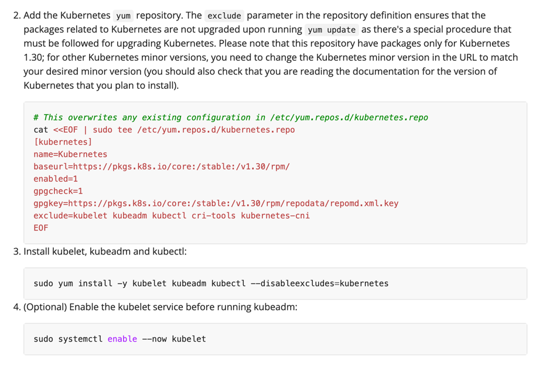
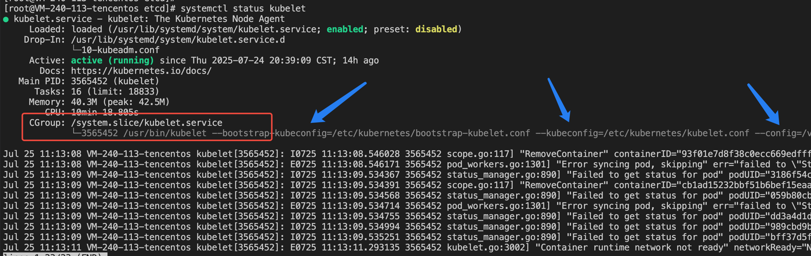

## 单机安装k8s

### 基于kubeadm的方式安装

在centos上安装 kubeadm、kubectl、kubelet工具
[install kubeadm](https://v1-30.docs.kubernetes.io/docs/setup/production-environment/tools/kubeadm/install-kubeadm/)

```text
cat <<EOF | sudo tee /etc/yum.repos.d/kubernetes.repo
[kubernetes]
name=Kubernetes
baseurl=https://pkgs.k8s.io/core:/stable:/v1.30/rpm/
enabled=1
gpgcheck=1
gpgkey=https://pkgs.k8s.io/core:/stable:/v1.30/rpm/repodata/repomd.xml.key
exclude=kubelet kubeadm kubectl cri-tools kubernetes-cni
EOF


sudo yum install -y kubelet kubeadm kubectl --disableexcludes=kubernetes


sudo systemctl enable --now kubelet
```
执行完上面的命令后，可以在控制台中执行: kubectl | kubeadm 等命令了


安装 containerd
https://github.com/containerd/containerd/blob/main/docs/getting-started.md


通过kubeadm安装k8s
https://v1-30.docs.kubernetes.io/docs/setup/production-environment/tools/kubeadm/create-cluster-kubeadm/
```text
kubeadm init
```
执行完后，会有以下命令
```text
Your Kubernetes control-plane has initialized successfully!

To start using your cluster, you need to run the following as a regular user:

  mkdir -p $HOME/.kube
  sudo cp -i /etc/kubernetes/admin.conf $HOME/.kube/config
  sudo chown $(id -u):$(id -g) $HOME/.kube/config

Alternatively, if you are the root user, you can run:

  export KUBECONFIG=/etc/kubernetes/admin.conf

You should now deploy a pod network to the cluster.  // 部署一个网络，但是单机应该不需要吧，后续再了解
Run "kubectl apply -f [podnetwork].yaml" with one of the options listed at:
  https://kubernetes.io/docs/concepts/cluster-administration/addons/

Then you can join any number of worker nodes by running the following on each as root:

kubeadm join 21.91.240.113:6443 --token 2vn752.c6i7n7v6nkceysx9 \
        --discovery-token-ca-cert-hash sha256:1d989616453d16219f9c6870dceed600aa089599e685fbecb44df2088c128f4a 
```


static pod
log:
> /var/log/pods

pod:
```text
etcd
kube-apiserver
kube-controller-manager
kube-proxy
kube-scheduler
```
crictl ps 查看 static pod
crictl ps -a 查看退出的 pod

配置信息：
/etc/kubernetes/manifests 下存在了static pod的yaml配置

查看kubelet的日志
journalctl -u kubelet -f

# 手动执行健康检查命令
crictl exec -it <etcd容器ID> etcdctl endpoint health


在 Docker 中部署 etcd 可以通过直接运行官方 etcd镜像来实现，以下是详细步骤：

docker run -d \
--name etcd2 \
-p 12379:12379 \
-p 12380:12380 \
-v /var/lib/etcd:/etcd-data \
quay.io/coreos/etcd:v3.5.0 \
etcd \
--name etcd-single \
--data-dir /etcd-data \
--listen-client-urls http://0.0.0.0:12379 \
--advertise-client-urls http://21.91.240.113:12379 \
--listen-peer-urls http://0.0.0.0:12380 \
--initial-advertise-peer-urls http://21.91.240.113:12380 \
--initial-cluster etcd-single=http://21.91.240.113:12380 \
--initial-cluster-token etcd-cluster-1 \
--initial-cluster-state new

```text
docker run -d \
--name etcd3 \
-p 2379:2379 \
-p 2380:2380 \
-v /var/lib/etcd:/etcd-data \
quay.io/coreos/etcd:v3.5.0 \
etcd \
--data-dir /etcd-data \
--advertise-client-urls=https://21.91.240.113:2379 \
--cert-file=/etc/kubernetes/pki/etcd/server.crt \
--client-cert-auth=true \
--data-dir=/var/lib/etcd \
--experimental-initial-corrupt-check=true \
--experimental-watch-progress-notify-interval=5s \
--initial-advertise-peer-urls=https://21.91.240.113:2380 \
--initial-cluster=vm-240-113-tencentos=https://21.91.240.113:2380 \
--key-file=/etc/kubernetes/pki/etcd/server.key \
--listen-client-urls=https://0.0.0.0:2379 \
--listen-metrics-urls=http:/0.0.0.0:2381 \
--listen-peer-urls=https://0.0.0.0:2380 \
--name=vm-240-113-tencentos \
--peer-cert-file=/etc/kubernetes/pki/etcd/peer.crt \
--peer-client-cert-auth=true \
--peer-key-file=/etc/kubernetes/pki/etcd/peer.key \
--peer-trusted-ca-file=/etc/kubernetes/pki/etcd/ca.crt \
--snapshot-count=10000 \
--trusted-ca-file=/etc/kubernetes/pki/etcd/ca.crt \
--initial-cluster-state new


etcd \
--data-dir /etcd-data \
--advertise-client-urls=https://21.91.240.113:2379 \
--cert-file=/etc/kubernetes/pki/etcd/server.crt \
--client-cert-auth=true \
--data-dir=/var/lib/etcd \
--experimental-initial-corrupt-check=true \
--experimental-watch-progress-notify-interval=5s \
--initial-advertise-peer-urls=https://21.91.240.113:2380 \
--initial-cluster=vm-240-113-tencentos=https://21.91.240.113:2380 \
--key-file=/etc/kubernetes/pki/etcd/server.key \
--listen-client-urls=https://0.0.0.0:2379 \
--listen-metrics-urls=http://0.0.0.0:2381 \
--listen-peer-urls=https://0.0.0.0:2380 \
--name=vm-240-113-tencentos \
--peer-cert-file=/etc/kubernetes/pki/etcd/peer.crt \
--peer-client-cert-auth=true \
--peer-key-file=/etc/kubernetes/pki/etcd/peer.key \
--peer-trusted-ca-file=/etc/kubernetes/pki/etcd/ca.crt \
--snapshot-count=10000 \
--trusted-ca-file=/etc/kubernetes/pki/etcd/ca.crt \
--initial-cluster-state new
```


```text
openssl x509 -in /etc/kubernetes/pki/etcd/server.crt -noout -text | grep "Subject:"
openssl x509 -in /etc/kubernetes/pki/etcd/peer.crt -noout -text | grep "Subject:"

openssl x509 -in /etc/kubernetes/pki/etcd/server.crt -noout -text | grep "IP Address"
```


### 安装k8s中遇到etcd和kube-apiserver起不来的问题
安装方式:
kubeadm init --upload-certs

go version
> go version go1.23.11 linux/amd64

kubeadm version
> kubeadm version: &version.Info{Major:"1", Minor:"32", GitVersion:"v1.32.7", GitCommit:"158eee9fac884b429a92465edd0d88a43f81de34", GitTreeState:"clean", 
> BuildDate:"2025-07-15T18:06:15Z", GoVersion:"go1.23.10", Compiler:"gc", Platform:"linux/amd64"}

cgroupDriver使用默认的，默认使用systemd

#### 问题描述： kubelet通过6443端口(kube-apiserver)管理etcd的健康检查，kube-apiserver依赖于etcd，形成了循环依赖
kubelet 通过6443端口做监控检测管理etcd,如果拿不到消息，会终止etcd的运行（重启etcd），kubelet会认为etcd服务异常
kube-apiserver 会依赖于etcd，如果etcd没有启动起来，就会启动失败
etcd 在kubelet健康检查时，如果通过6443拉取不到健康检查数据，就会销毁重建etcd

**日志信息：**

kubelet的日志信息： journalctl -u kubelet -f | grep 'etcd'
```text
Jul 24 19:57:32 VM-240-113-tencentos kubelet[3454780]: I0724 19:57:32.603521 3454780 status_manager.go:890] "Failed to get status for pod" 
podUID="059b80cb43e7e314c273197c4a18f765" 
pod="kube-system/etcd-vm-240-113-tencentos" 
err="Get \"https://21.91.240.113:6443/api/v1/namespaces/kube-system/pods/etcd-vm-240-113-tencentos\": 
dial tcp 21.91.240.113:6443: connect: connection refused"
```

etcd 的日志信息：crictl logs etcd-container-id 或者 cat /var/log/pods/kube-system_etcd-vm-xxx/etcd/0.log
```text
在服务启动后，间隔心跳检测时间后，就会收到一条终止命令，从而导致了etcd pod的重启

 {"level":"info","ts":"2025-07-24T11:03:52.623152Z","caller":"osutil/interrupt_unix.go:64","msg":"received signal; shutting down","signal":"terminated"}
```

kube-apiserver的日志： 因为etcd的2379端口没有启动，所以报2379连接超时，从而退出
```text

```

**排查流程：**
kubelet应该管理static pod，应该直接从static pod中获取etcd的健康检测信息，而不是通过6443端口获取

kubelet 服务信息： systemctl status kubelet


查看kubelet启动时关联的配置信息：
```bash
/usr/bin/kubelet 
--bootstrap-kubeconfig=/etc/kubernetes/bootstrap-kubelet.conf 
--kubeconfig=/etc/kubernetes/kubelet.conf 
--config=/var/lib/kubelet/config.yaml 
--container-runtime-endpoint=unix:///var/run/containerd/containerd.sock 
--pod-infra-container-image=registry.k8s.io/pause:3.10
```

| 启动参数 | 启动参数引用配置 | 配置信息    |
|------|----------|---------|
|  --bootstrap-kubeconfig    |   /etc/kubernetes/bootstrap-kubelet.conf       | 不存在     |
|  --kubeconfig    |  /etc/kubernetes/kubelet.conf         | 没什么关键配置 |
|  --config    |    var/lib/kubelet/config.yaml      | 关键配置    |


cat /var/lib/kubelet/config.yaml
```yaml
staticPodPath: /etc/kubernetes/manifests
```
从上面的配置可以看出，kubelet是管理的static pod，但是kubelet为什么会通过6443获取健康检测呢？？ -- 纳闷

排查不到具体原因，哎~~~~

### kubelet 检测各个组件的心跳

就你妈的离谱，感觉就是kubelet连接不上kube-apiserver，拿不到信息

kube-apiserver
```text
"Failed to get status for pod" podUID="7ea751a639439ae3a9219adfcdc334ce" 
pod="kube-system/kube-apiserver-vm-116-200-tencentos" 
err="Get \"https://9.134.116.200:6443/api/v1/namespaces/kube-system/pods/kube-apiserver-vm-116-200-tencentos\": 
dial tcp 9.134.116.200:6443: connect: connection refused"
```

kube-scheduler
```text
"Failed to get status for pod" podUID="7cb1bb86b7e67be83a91c2c2f79d7ef6" 
pod="kube-system/kube-scheduler-vm-116-200-tencentos" 
err="Get \"https://9.134.116.200:6443/api/v1/namespaces/kube-system/pods/kube-scheduler-vm-116-200-tencentos\": 
dial tcp 9.134.116.200:6443: connect: connection refused"
```

kube-controller-manager
```text
"Failed to get status for pod" podUID="f8aab4008741b4a568cb7abb2814bac9"
pod="kube-system/kube-controller-manager-vm-116-200-tencentos" 
err="Get \"https://9.134.116.200:6443/api/v1/namespaces/kube-system/pods/kube-controller-manager-vm-116-200-tencentos\": 
dial tcp 9.134.116.200:6443: connect: connection refused"
```

etcd
```text
"Failed to get status for pod" podUID="bad65cdf7825e389ca5a539172dac914" 
pod="kube-system/etcd-vm-116-200-tencentos" 
err="Get \"https://9.134.116.200:6443/api/v1/namespaces/kube-system/pods/etcd-vm-116-200-tencentos\": 
dial tcp 9.134.116.200:6443: connect: connection refused"
```

### kubelet 报错说： cni plugin not initialized
```text
"Container runtime network not ready" 
networkReady="NetworkReady=false reason:NetworkPluginNotReady message:Network plugin returns error: cni plugin not initialized"
```
