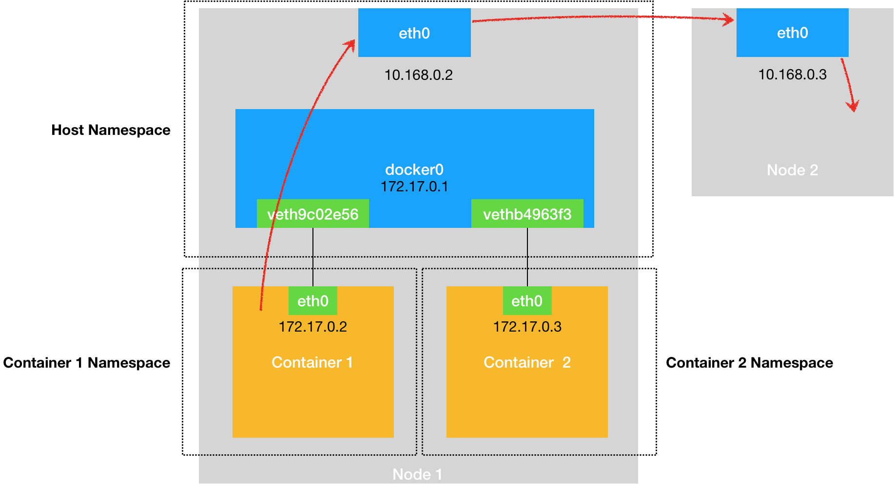

## 在同一个node里，不同的container直接是如何通信的？
以docker的方式来验证container之间的相互通信

当docker部署成功后，docker会将网卡列表中插入一个docker0（网桥）的网卡用于网络收发，我们可以通过ifconfig查询
```bash
systemctl status docker

ifconfig
```


在docker场景下(docker是单容器部署，而k8s的pod是多容器部署)，容器的本质就是进程，而docker为了让容器与容器之间不相互影响
于是基于linux下的各种namespace做了隔离，比如：Network namespace | PID namespaces and so on

而在docker下的容器都有自己的network namespace 他们直接是否隔离的，不能直接通信
(当然可以通过启动参数，指定容器使用宿主机的network namespace,这样容器之间就没有网络隔离，这样就可以直接通信
但是这样就会导致一个问题，容易端口冲突 -- 毕竟是使用宿主机的network namespace)

那什么方式可以实现跨network namespace通信呢？
> 答案：veth pair
> 
> veth pair 总是成对出现的，比如 A B，A B之间的通信可以跨network namespaces
> 
> veth pair 就是用来解决容器直接的通信问题的


### 容器与容器之间的通信

图中中的container1、container2中的eth0 和宿主机中的vethxxxx就是veth pair

veth pair的一端作为容器的eth0，另一端作为宿主机上的veth(虚拟网卡，并插在了docker0这个网桥上)
```text
可以通过 ifconfig 查看 docker0 和 vethxxx的信息

可以通过brctl show 查看veth 和 docker0(网桥)的绑定信息
veth与docker0绑定后，就丢失了路由分发数据包的能力，转由docker0处理；此时的veth就只作为收发数据的"端口"
```
通信流程：
container1：172.17.0.2
container2：172.17.0.3
```text
container1:
route: 查看路由信息,发现默认通过eth0发送

container2:
route: 查看路由信息,发现默认通过eth0发送
```
当在 container1 中ping 172.17.0.3时：
```text
1、通过eth0发送数据包，通过veth pair 发送到docker0中，docker0并不知道172.17.0.3(不知道对应的mac地址)，于是广播ARP，向所有插入在docker0上的veth发送ARP请求
2、container2接收到ARP包后，把自己的mac地址回给docker0
3、docker0路由转发到container2中
4、container2 收到ping请求，响应pong
```

### 容器与另一个node通信


container1: 172.17.0.2
node2: 10.168.0.3

在container1中ping 10.168.0.3
```text
1、container1 基于veth pair 将数据包发送到docker0中
2、由于docker0不能处理 10.168.0.3 于是转由宿主机的route对请求转发
3、宿主机上的eth0匹配，并转发请求到node2(10.168.0.3) -- 前提是 node1 和 node2 本身是可通信的
4、node2收到ping请求，响应pong
```


### 当前node与容器通信

node1 10.168.0.2
container1：172.17.0.2

宿主机上ping 172.17.0.2
```text
1、宿主机上ping 172.17.0.2，通过route找到docker0网桥
2、docker0通过mac学习(ARP)，拿到了container1的mac
3、docker0将请求发送给container1
4、container1 接收到ping请求，响应pong
```

### node1中的容器 与node2中的容器通信
因为node1和node2中的docker0都是各个node私有的，相互之间是无法通信的，所以不同node中的容器是不能直接通信的

解决方式：
使用一种软件技术，让其node使用同一个虚拟网桥： Overlay Network（覆盖网络）
