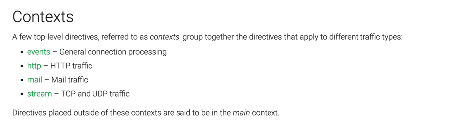

## nginx 
https://nginx.org/en/docs/

nginx has one master process and several worker processes. 
> The main purpose of the master process is to read and evaluate configuration, and maintain worker processes. 
> Worker processes do actual processing of requests


### install nginx
建议直接使用docker安装，比较方便
```text
docker pull nginx:xxx

docker run -d nginx:xxx

docker exec -it docker_id /bin/bash
```

其他安装方式，参考nginx的文档

### usage nginx
starting、stopping、reload nginx configuration and so on

NGINX has one master process and one or more worker processes；If caching is enabled, the cache loader and cache manager processes also run at startup.
> master process: read and evaluate configuration files; and as well as maintain the worker processes
> worker process: do the actual processing of requests

worker process number 在nginx.conf里面配置；可以使用固定值，也可以使用动态值(根据机器的cpu cores)

```bash
nginx -s <single>
```
- quit : 安全退出，需要等待worker process 处理完成
- reload : master process重新加载配置；经过master process的校验后，新创建的worker process使用新的config；并通知旧的worker process处理完后，就quit
- reopen : reopen log files
- stop : fast shutdown 无需等待worker process的处理

kill 的方式杀死nginx应用:
> nginx.pid in the directory /usr/local/nginx/logs or /var/run
```bash
kill -s QUIT 1628
```

ps 查看nginx 应用
ps -ax | grep nginx

### nginx config
The events and http directives reside in the main context, server in http, and location in server

```conf
http {
   server {
       localtion / {
       }
   }
}
```

新版的nginx plus



```editorconfig
user nobody; # a directive in the 'main' context

events {
    # configuration of connection processing
}

http {
    # Configuration specific to HTTP and affecting all virtual servers

    server {
        # configuration of HTTP virtual server 1
        location /one {
            # configuration for processing URIs starting with '/one'
        }
        location /two {
            # configuration for processing URIs starting with '/two'
        }
    }

    server {
        # configuration of HTTP virtual server 2
    }
}

stream {
    # Configuration specific to TCP/UDP and affecting all virtual servers
    server {
        # configuration of TCP virtual server 1
    }
}
```