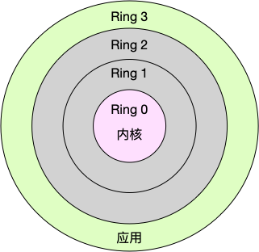
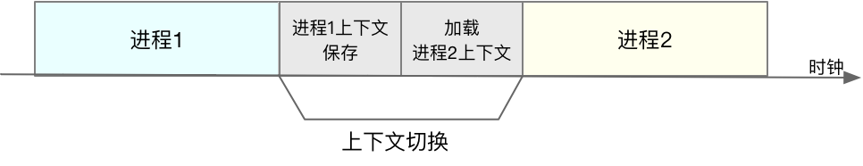

## cpu上下文切换

为什么需要cpu的上下文切换呢？
> 在linux系统中，不是所有的任务都能并行的执行的，
> 比如在4g 2核cpu的linux系统中，在系统中真正只有两个任务可以并行的执行，
> 但对于用户来说，该系统可以"同时"运行多个远超cpu数量的任务；
> 然而这些远超cpu数量的任务其实并不是真正意义上的并行执行的，系统将cpu分片后分给了每个任务，给了用户一种幻觉""感觉这些任务都在同时运行"
> 这种现象就是通过cpu上下文切换来实现的

### 什么是cpu的上下文
在cpu运行任务前，cpu需要知道从哪里加载任务，加载的任务从哪里开始运行；
也就是说，需要系统事先帮它设置好 CPU 寄存器和程序计数器（Program Counter，PC）。

> CPU 寄存器: 是CPU内置的容量小、但速度极快的内存
> 程序计数器:  则是用来存储 CPU 正在执行的指令位置、或者即将执行的下一条指令位置

它们都是 CPU 在运行任何任务前，必须的依赖环境，因此也被叫做 CPU 上下文。
而每个任务的自己信息存放在寄存器中的数据不一样，程序计数器的信息也不一样，所以在不同任务见切换，需要切换cpu寄存器和程序计数器；所以也叫做cpu的上下文切换


### 什么是cpu的上下文切换

CPU 上下文切换 三个步骤：
 - 先把前一个任务的 CPU 上下文（也就是 CPU 寄存器和程序计数器）保存起来，
 - 然后加载新任务的上下文到这些寄存器和程序计数器，
 - 最后再跳转到程序计数器所指的新位置，运行新任务。

### 根据任务的不同，可分为不同种cpu上下文切换

 - 进程上下文切换
 - 线程上下文切换
 - 中断上下文切换

### 进程上下文切换
Linux 按照特权等级，把进程的运行空间分为内核空间和用户空间

 - 内核空间（Ring 0）具有最高权限，可以直接访问所有资源；
 - 用户空间（Ring 3）只能访问受限资源，不能直接访问内存等硬件设备，必须通过系统调用陷入到内核中，才能访问这些特权资源。

进程既可以在用户空间运行，又可以在内核空间中运行。进程在用户空间运行时，被称为进程的用户态，
而陷入内核空间的时候，被称为进程的内核态。

进程从用户态到内核态，需要通过**系统调用**来完成
> 比如，当我们查看文件内容时，就需要多次系统调用来完成：
> 首先调用 open() 打开文件，
> 然后调用 read() 读取文件内容，
> 并调用 write() 将内容写到标准输出，
> 最后再调用 close() 关闭文件。

其中的open()、read()、write()、close() 都是系统调用

而系统调用的过程中，就会发生cpu的上下文切换
```text
CPU 寄存器里原来是用户态的指令位置，需要先保存起来。接着，为了执行内核态代码，
CPU 寄存器需要更新为内核态指令的新位置。最后才是跳转到内核态运行内核任务
而系统调用结束后，CPU 寄存器需要恢复原来保存的用户态，然后再切换到用户空间，继续运行进程。

所以：一次系统调用的过程，其实是发生了两次 CPU 上下文切换
```
_注意📢：系统调用过程中，并不会涉及到虚拟内存等进程用户态的资源，也不会切换进程。_

 - 进程上下文切换，是指从一个进程切换到另一个进程运行。
 - 而系统调用过程中一直是同一个进程在运行。

 所以，系统调用过程通常称为特权模式切换，而不是上下文切换。但实际上，系统调用过程中，CPU 的上下文切换还是无法避免的。

#### 进程上下文切换跟系统调用又有什么区别呢？
进程是由内核来管理和调度的，进程的切换只能发生在内核态。
所以，进程的上下文不仅包括了虚拟内存、栈、全局变量等用户空间的资源，
还包括了内核堆栈、寄存器等内核空间的状态。
```text
因此，进程的上下文切换就比系统调用时多了一步：
    在保存当前进程的内核状态和 CPU 寄存器之前，需要先把该进程的虚拟内存、栈等保存下来；
    而加载了下一进程的内核态后，还需要刷新进程的虚拟内存和用户栈
```



#### 什么时候会切换进程上下文？
进程切换时才需要切换上下文，换句话说，只有在进程调度的时候，才需要切换上下文。

> Linux 为每个 CPU 都维护了一个就绪队列，将活跃进程（即正在运行和正在等待 CPU 的进程）按照优先级和等待 CPU 的时间排序，
> 然后选择最需要 CPU 的进程，也就是优先级最高和等待 CPU 时间最长的进程来运行。

进程在什么时候才会被调度到 CPU 上运行呢？
- 其一，为了保证所有进程可以得到公平调度，CPU 时间被划分为一段段的时间片，这些时间片再被轮流分配给各个进程。这样，当某个进程的时间片耗尽了，就会被系统挂起，切换到其它正在等待 CPU 的进程运行。
- 其二，进程在系统资源不足（比如内存不足）时，要等到资源满足后才可以运行，这个时候进程也会被挂起，并由系统调度其他进程运行。
- 其三，当进程通过睡眠函数  sleep 这样的方法将自己主动挂起时，自然也会重新调度。
- 其四，当有优先级更高的进程运行时，为了保证高优先级进程的运行，当前进程会被挂起，由高优先级进程来运行。
- 最后一个，发生硬件中断时，CPU 上的进程会被中断挂起，转而执行内核中的中断服务程序。

### 线程上下文切换
线程与进程最大的区别在于:
 - 线程是调度的基本单位，
 - 进程则是资源拥有的基本单位。
 
说白了，所谓内核中的任务调度，实际上的调度对象是线程；而进程只是给线程提供了虚拟内存、全局变量等资源。

线程和进程，我们可以这么理解:
```text
当进程只有一个线程时，可以认为进程就等于线程。

当进程拥有多个线程时，这些线程会共享相同的虚拟内存和全局变量等资源。这些资源在上下文切换时是不需要修改的。

另外，线程也有自己的私有数据，比如栈和寄存器等，这些在上下文切换时也是需要保存的。
```
#### 线程的上下文切换其实就可以分为两种情况：
- 第一种，前后两个线程属于不同进程。此时，因为资源不共享，所以切换过程就跟进程上下文切换是一样
- 第二种，前后两个线程属于同一个进程。此时，因为虚拟内存是共享的，所以在切换时，虚拟内存这些资源就保持不动，只需要切换线程的私有数据、寄存器等不共享的数据

**同为上下文切换，但同进程内的线程切换，要比多进程间的切换消耗更少的资源，而这，也正是多线程代替多进程的一个优势**

### 中断上下文切换
为了快速响应硬件的事件，中断处理会打断进程的正常调度和执行，转而调用中断处理程序，响应设备事件

跟进程上下文不同，中断上下文切换并不涉及到进程的用户态
中断上下文，其实只包括内核态中断服务程序执行所必需的状态，包括 CPU 寄存器、内核堆栈、硬件中断参数等。

对同一个 CPU 来说，中断处理比进程拥有更高的优先级

## cpu上下文切换实战
如何是否是cpu上下文切换过多导致的cpu执行效率低下呢？ 这就需要用到一些查看命令了
比如：
  vmstat
  pidstat
  /proc/interrupts

### 怎么查看系统的上下文切换情况
vmstat 是一个常用的系统性能分析工具，主要用来分析系统的内存使用情况，也常用来分析 CPU 上下文切换和中断的次数。
```text
# 每隔5秒输出1组数据
$ vmstat 5
procs -----------memory---------- ---swap-- -----io---- -system-- ------cpu-----
 r  b   swpd   free   buff  cache   si   so    bi    bo   in   cs us sy id wa st
 0  0      0 7005360  91564 818900    0    0     0     0   25   33  0  0 100  0  0

```
其中：
- cs（context switch）是每秒上下文切换的次数。
- in（interrupt）则是每秒中断的次数。
- r（Running or Runnable）是就绪队列的长度，也就是正在运行和等待 CPU 的进程数。
- b（Blocked）则是处于不可中断睡眠状态的进程数

#### 查看每个进程上下文切换的情况
```text
# 每隔5秒输出1组数据
$ pidstat -w 5
Linux 4.15.0 (ubuntu)  09/23/18  _x86_64_  (2 CPU)

08:18:26      UID       PID   cswch/s nvcswch/s  Command
08:18:31        0         1      0.20      0.00  systemd
08:18:31        0         8      5.40      0.00  rcu_sched
...
```
其中:
- 一个是  cswch  ，表示每秒自愿上下文切换（voluntary context switches）的次数，
- 一个则是  nvcswch  ，表示每秒非自愿上下文切换（non voluntary context switches）的次数
```text
所谓自愿上下文切换，是指进程无法获取所需资源，导致的上下文切换。比如说， I/O、内存等系统资源不足时，就会发生自愿上下文切换。

而非自愿上下文切换，则是指进程由于时间片已到等原因，被系统强制调度，进而发生的上下文切换。比如说，大量进程都在争抢 CPU 时，就容易发生非自愿上下文切换。
```

#### 查看中断的切换信息
```text
# -d 参数表示高亮显示变化的区域
$ watch -d cat /proc/interrupts
           CPU0       CPU1
...
RES:    2450431    5279697   Rescheduling interrupts
...
```

#### 如何判断cpu上下文中断是否影响性能：
如果系统的上下文切换次数比较稳定，那么从数百到一万以内，都应该算是正常的。
但当上下文切换次数超过一万次，或者切换次数出现数量级的增长时，就很可能已经出现了性能问题
```text
自愿上下文切换变多了，说明进程都在等待资源，有可能发生了 I/O 等其他问题；

非自愿上下文切换变多了，说明进程都在被强制调度，也就是都在争抢 CPU，说明 CPU 的确成了瓶颈；

中断次数变多了，说明 CPU 被中断处理程序占用，还需要通过查看 /proc/interrupts 文件来分析具体的中断类型。
```
