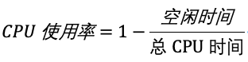
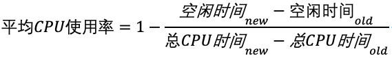

## 某个应用的CPU使用率居然达到100%，我该怎么办？

先通过 top、ps、pidstat 定位到哪个进程cpu消耗过高：主要是定位cpu消耗在哪个位置了，比如：用户态、内核态、io等待、硬中断、软中断等等
再通过perf top、perf record 、perf report 等工具查看

### 查看cpu使用率

这是开机以来的节拍数累加值，所以直接算出来的，是开机以来的平均 CPU 使用率，一般没啥参考价值。
```bash
# 系统cpu统计
cat /proc/stat | grep ^cpu

# 进程cpu统计
cat /proc/[pid]/stat | grep ^cpu
```

可以通过man proc 查看查询到的信息

 - user（通常缩写为 us），代表用户态 CPU 时间。注意，它不包括下面的 nice 时间，但包括了 guest 时间。
 - nice（通常缩写为 ni），代表低优先级用户态 CPU 时间，也就是进程的 nice 值被调整为 1-19 之间时的 CPU 时间。这里注意，nice 可取值范围是 -20 到 19，数值越大，优先级反而越低。
 - system（通常缩写为 sys），代表内核态 CPU 时间。
 - idle（通常缩写为 id），代表空闲时间。注意，它不包括等待 I/O 的时间（iowait）。
 - iowait（通常缩写为 wa），代表等待 I/O 的 CPU 时间。
 - irq（通常缩写为 hi），代表处理硬中断的 CPU 时间。 
 - softirq（通常缩写为 si），代表处理软中断的 CPU 时间。
 - steal（通常缩写为 st），代表当系统运行在虚拟机中的时候，被其他虚拟机占用的 CPU 时间。
 - guest（通常缩写为 guest），代表通过虚拟化运行其他操作系统的时间，也就是运行虚拟机的 CPU 时间。
 - guest_nice（通常缩写为 gnice），代表以低优先级运行虚拟机的时间。

CPU 使用率，就是除了空闲时间外的其他时间占总 CPU 时间的百分比


一般性能工具会通过一段时间的cpu使用来计算cpu的使用率


使用性能工具时的注意项:
> 性能分析工具给出的都是间隔一段时间的平均 CPU 使用率，所以要注意间隔时间的设置，特别是用多个工具对比分析时，
> 你一定要保证它们用的是相同的间隔时间。

top 工具默认是3秒时间间隔，而 ps 使用的却是进程的整个生命周期

top 并没有细分进程的用户态 CPU 和内核态 CPU；所以需要再根据pidstat查询进程统计信息
```text
# 每隔1秒输出一组数据，共输出5组
$ pidstat 1 5
15:56:02      UID       PID    %usr %system  %guest   %wait    %CPU   CPU  Command
15:56:03        0     15006    0.00    0.99    0.00    0.00    0.99     1  dockerd

...

Average:      UID       PID    %usr %system  %guest   %wait    %CPU   CPU  Command
Average:        0     15006    0.00    0.99    0.00    0.00    0.99     -  dockerd
```
```text
用户态 CPU 使用率 （%usr）；
内核态 CPU 使用率（%system）；
运行虚拟机 CPU 使用率（%guest）；
等待 CPU 使用率（%wait）；
以及总的 CPU 使用率（%CPU）。
```

### CPU 使用率过高怎么办？
1、通过 top、ps、pidstat 等工具，你能够轻松找到 CPU 使用率较高（比如 100% ）的进程
2、使用 perf 分析 CPU 性能问题

#### perf top 
实时展示了系统的性能信息，但它的缺点是并不保存数据，也就无法用于离线或者后续的分析

```text
$ perf top
Samples: 833  of event 'cpu-clock', Event count (approx.): 97742399
Overhead  Shared             Object Symbol
   7.28%  perf                [.] 0x00000000001f78a4
   4.72%  [kernel]            [k] vsnprintf
   4.32%  [kernel]            [k] module_get_kallsym
   3.65%  [kernel]            [k] _raw_spin_unlock_irqrestore
...
```
```text
第一列 Overhead ，是该符号的性能事件在所有采样中的比例，用百分比来表示。

第二列 Shared ，是该函数或指令所在的动态共享对象（Dynamic Shared Object），如内核、进程名、动态链接库名、内核模块名等。

第三列 Object ，是动态共享对象的类型。比如 [.] 表示用户空间的可执行程序、或者动态链接库，而 [k] 则表示内核空间。

最后一列 Symbol 是符号名，也就是函数名。当函数名未知时，用十六进制的地址来表示。
```
#### pref record 和 pref report
perf record 则提供了保存数据的功能，保存后的数据，需要你用 perf report 解析展示

```text
$ perf record # 按Ctrl+C终止采样
[ perf record: Woken up 1 times to write data ]
[ perf record: Captured and wrote 0.452 MB perf.data (6093 samples) ]

$ perf report # 展示类似于perf top的报告
```