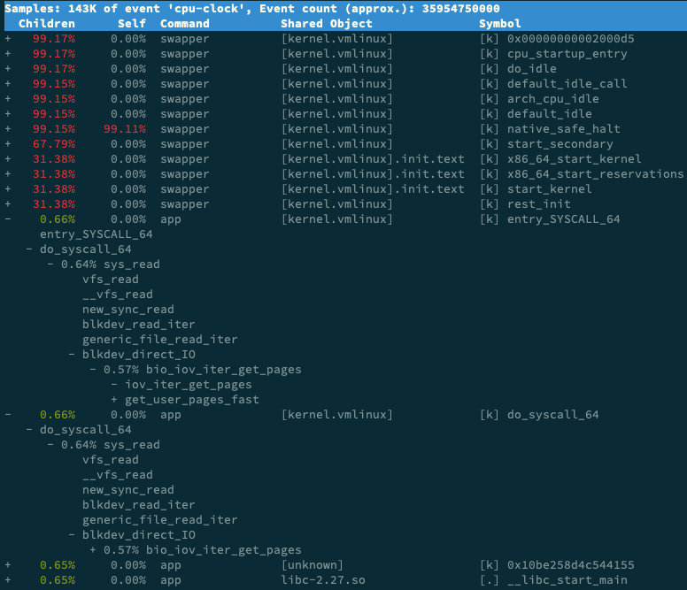

## 排查cpu使用过高的原因

学习和总结cpu的排查经验，这个对自己定位线上linux的问题很有帮助的

### 系统的CPU使用率很高，但为啥却找不到高CPU的应用？
ab（apache bench）是一个常用的 HTTP 服务性能测试工具

```bash
 yum install httpd-tools -y
```

```text
# 并发100个请求测试Nginx性能，总共测试1000个请求
$ ab -c 100 -n 1000 http://192.168.0.10:10000/
This is ApacheBench, Version 2.3 <$Revision: 1706008 $>
Copyright 1996 Adam Twiss, Zeus Technology Ltd, 
...
Requests per second:    87.86 [#/sec] (mean)
Time per request:       1138.229 [ms] (mean)
...
```
从 ab 的输出结果我们可以看到，Nginx 能承受的每秒平均请求数，只有 87 多一点，是不是感觉它的性能有点差呀。那么，到底是哪里出了问题呢？

持续压测: 并发请求5 ，持续600秒
```text
$ ab -c 5 -t 600 http://192.168.0.10:10000/
```

排查思路：
1、通过top命令观察cpu使用量
```text
系统的整体 CPU 使用率是比较高的：用户 CPU 使用率（us）已经到了 80%，系统 CPU 为 15.1%，而空闲 CPU （id）则只有 2.8%。
```
但是通过top分析下来，进程都看完了，也没有找到80%的us cpu使用率花在了什么地方

2、尝试使用 pidstat 排查；它可以用来分析进程的 CPU 使用情况。
```text
# 不知道如何使用命名参数时，可以通过man查看文档信息
# 间隔1秒输出一组数据（按Ctrl+C结束）
pidstat 1
```
但是通过pidstat命名查询结果来看，几乎所有的进程的cpu使用量加起来也不到80%

3、重新使用top命令，多观察一会儿，看是否有短时进程
通过查看进程状态判断哪些进程正在运行中，然后去分析正在运行中的进程
```text
通过排查运行中的进程，通过pidstat -p PID，发现没有输出信息 （难道是工具出错了）
然后再使用ps aux 命令查看运行中的进程，发现 PID不在了

反复推敲后，通过top、ps、pidstat 发现，存在进程不断重启、或者有短时进程
```

4、分析短时进程、或者重启的进程，需要找到其父进程
```text
# 这里的stress进程就是有问题的进程、stress进程是一个常用的压力测试工具
pstree | grep stress


$ pstree | grep stress
        |-docker-containe-+-php-fpm-+-php-fpm---sh---stress
        |         |-3*[php-fpm---sh---stress---stress]
```
stress 是被 php-fpm 调用的子进程，并且进程数量不止一个（这里是 3 个）。找到父进程后，我们能进入 app 的内部分析了

然后进入php-fpm，排查问题：发现是内部调用了stress进程，再通过日志信息查看stress进程失败是因为权限问题

5、到此就分析处理us cpu使用率高的原因了

#### 除了上面的top、ps、pstree 命令外，还可以使用哪些命令查看这种问题
1、可以通过perf
```text
# 记录性能事件，等待大约15秒后按 Ctrl+C 退出
$ perf record -g

# 查看报告
$ perf report
```
2、execsnoop
https://github.com/brendangregg/perf-tools/blob/master/execsnoop
```text
execsnoop就是一个专为短时进程设计的工具。它通过 ftrace 实时监控进程的 exec() 行为，并输出短时进程的基本信息，包括进程 PID、父进程 PID、命令行参数以及执行的结果。
```
#### 总结
碰到常规问题无法解释的 CPU 使用率情况时，首先要想到有可能是短时应用导致的问题

### 系统中出现了大量的不可中断线程和僵尸进程


CPU 使用率的类型
 - 系统 CPU（比如上下文切换）
 - 等待 I/O 的 CPU（比如等待磁盘的响应）
 - 中断 CPU（包括软中断和硬中断）
 -

进程的状态
> top ps 等命令可以查看进程信息，其中S 列（也就是 Status  列），表示进程状态；可以看到 R、D、Z、S、I 等几个状态

- R 是 Running 或 Runnable 的缩写，表示进程在 CPU 的就绪队列中，正在运行或者正在等待运行。
- D 是 Disk Sleep 的缩写，也就是不可中断状态睡眠（Uninterruptible Sleep），一般表示进程正在跟硬件交互，并且交互过程不允许被其他进程或中断打断。
- Z 是 Zombie 的缩写，如果你玩过“植物大战僵尸”这款游戏，应该知道它的意思。它表示僵尸进程，也就是进程实际上已经结束了，但是父进程还没有回收它的资源（比如进程的描述符、PID 等）。
- S 是 Interruptible Sleep 的缩写，也就是可中断状态睡眠，表示进程因为等待某个事件而被系统挂起。当进程等待的事件发生时，它会被唤醒并进入 R 状态。
- I 是 Idle 的缩写，也就是空闲状态，用在不可中断睡眠的内核线程上。前面说了，硬件交互导致的不可中断进程用 D 表示，但对某些内核线程来说，它们有可能实际上并没有任何负载，用 Idle 正是为了区分这种情况。要注意，D 状态的进程会导致平均负载升高， I 状态的进程却不会
- T 或者 t，也就是 Stopped 或 Traced 的缩写，表示进程处于暂停或者跟踪状态。
- X，也就是 Dead 的缩写，表示进程已经消亡，所以你不会在 top 或者 ps 命令中看到它。

如果有大量的D进程，系统可能出现了 I/O 等性能问题
> 如果系统或硬件发生了故障，进程可能会在不可中断状态保持很久，甚至导致系统中出现大量不可中断进程。这时，你就得注意下，系统是不是出现了 I/O 等性能问题。


不可中断状态
> 表示进程正在跟硬件交互，为了保护进程数据和硬件的一致性，系统不允许其他进程或中断打断这个进程。进程长时间处于不可中断状态，通常表示系统有 I/O 性能问题。

僵尸进程
> 表示进程已经退出，但它的父进程还没有回收子进程占用的资源。短暂的僵尸状态我们通常不必理会，但进程长时间处于僵尸状态，就应该注意了，可能有应用程序没有正常处理子进程的退出。


僵尸进程的产生
```text
正常情况下，当一个进程创建了子进程后，它应该通过系统调用 wait() 或者 waitpid() 等待子进程结束，回收子进程的资源；
而子进程在结束时，会向它的父进程发送 SIGCHLD 信号，所以，父进程还可以注册 SIGCHLD 信号的处理函数，异步回收资源。

如果父进程没这么做，或是子进程执行太快，父进程还没来得及处理子进程状态，子进程就已经提前退出，那这时的子进程就会变成僵尸进程
```
通常，僵尸进程持续的时间都比较短，在父进程回收它的资源后就会消亡；或者在父进程退出后，由 init 进程回收后也会消亡。

僵尸进程的危害
```text
一旦父进程没有处理子进程的终止，还一直保持运行状态，那么子进程就会一直处于僵尸状态。大量的僵尸进程会用尽 PID 进程号，导致新进程不能创建
```

#### 僵尸进程的排查过程
前提：
> 当前测试机器的配置：2核4g

1、执行top命名，观察进程的执行状态
```text
# 按下数字 1 切换到所有 CPU 的使用情况，观察一会儿按 Ctrl+C 结束
$ top
top - 05:56:23 up 17 days, 16:45,  2 users,  load average: 2.00, 1.68, 1.39
Tasks: 247 total,   1 running,  79 sleeping,   0 stopped, 115 zombie
%Cpu0  :  0.0 us,  0.7 sy,  0.0 ni, 38.9 id, 60.5 wa,  0.0 hi,  0.0 si,  0.0 st
%Cpu1  :  0.0 us,  0.7 sy,  0.0 ni,  4.7 id, 94.6 wa,  0.0 hi,  0.0 si,  0.0 st
...

  PID USER      PR  NI    VIRT    RES    SHR S  %CPU %MEM     TIME+ COMMAND
 4340 root      20   0   44676   4048   3432 R   0.3  0.0   0:00.05 top
 4345 root      20   0   37280  33624    860 D   0.3  0.0   0:00.01 app
 4344 root      20   0   37280  33624    860 D   0.3  0.4   0:00.01 app
    1 root      20   0  160072   9416   6752 S   0.0  0.1   0:38.59 systemd
...

```
top 输出结果分析：

 - 先看第一行的平均负载（ Load Average），过去 1 分钟、5 分钟和 15 分钟内的平均负载在依次减小，说明平均负载正在升高；而 1 分钟内的平均负载已经达到系统的 CPU 个数，说明系统很可能已经有了性能瓶颈。
 - 再看第二行的 Tasks，有 1 个正在运行的进程，但僵尸进程比较多，而且还在不停增加，说明有子进程在退出时没被清理。
 - 接下来看两个 CPU 的使用率情况，用户 CPU 和系统 CPU 都不高，但 iowait 分别是 60.5% 和 94.6%，好像有点儿不正常。
 - 最后再看每个进程的情况， CPU 使用率最高的进程只有 0.3%，看起来并不高；但有两个进程处于 D 状态，它们可能在等待 I/O，但光凭这里并不能确定是它们导致了 iowait 升高。

通过以上的分析，可以得到很明确的两点：
1、第一点，iowait 太高了，导致系统的平均负载升高，甚至达到了系统 CPU 的个数。

2、第二点，僵尸进程在不断增多，说明有程序没能正确清理子进程的资源。

#### iowait 分析
1、在终端中运行 dstat 命令，观察 CPU 和 I/O 的使用情况：
```text
# 间隔1秒输出10组数据
$ dstat 1 10
You did not select any stats, using -cdngy by default.
--total-cpu-usage-- -dsk/total- -net/total- ---paging-- ---system--
usr sys idl wai stl| read  writ| recv  send|  in   out | int   csw
  0   0  96   4   0|1219k  408k|   0     0 |   0     0 |  42   885
  0   0   2  98   0|  34M    0 | 198B  790B|   0     0 |  42   138
  0   0   0 100   0|  34M    0 |  66B  342B|   0     0 |  42   135
  0   0  84  16   0|5633k    0 |  66B  342B|   0     0 |  52   177
  0   3  39  58   0|  22M    0 |  66B  342B|   0     0 |  43   144
  0   0   0 100   0|  34M    0 | 200B  450B|   0     0 |  46   147
  0   0   2  98   0|  34M    0 |  66B  342B|   0     0 |  45   134
  0   0   0 100   0|  34M    0 |  66B  342B|   0     0 |  39   131
  0   0  83  17   0|5633k    0 |  66B  342B|   0     0 |  46   168
  0   3  39  59   0|  22M    0 |  66B  342B|   0     0 |  37   134
```
从 dstat 的输出，我们可以看到，每当 iowait 升高（wai）时，磁盘的读请求（read）都会很大。这说明 iowait 的升高跟磁盘的读请求有关，很可能就是磁盘读导致的。

2、运行 top 命令，观察 D 状态的进程
```text
# 观察一会儿按 Ctrl+C 结束
$ top
...
  PID USER      PR  NI    VIRT    RES    SHR S  %CPU %MEM     TIME+ COMMAND
 4340 root      20   0   44676   4048   3432 R   0.3  0.0   0:00.05 top
 4345 root      20   0   37280  33624    860 D   0.3  0.0   0:00.01 app
 4344 root      20   0   37280  33624    860 D   0.3  0.4   0:00.01 app
...
```
我们从 top 的输出找到 D 状态进程的 PID，你可以发现，这个界面里有两个 D 状态的进程，PID 分别是 4344 和 4345。

3、通过pidstat 查看指定进程的cpu和io情况
```text
# -d 展示 I/O 统计数据，-p 指定进程号，间隔 1 秒输出 3 组数据
$ pidstat -d -p 4344 1 3
06:38:50      UID       PID   kB_rd/s   kB_wr/s kB_ccwr/s iodelay  Command
06:38:51        0      4344      0.00      0.00      0.00       0  app
06:38:52        0      4344      0.00      0.00      0.00       0  app
06:38:53        0      4344      0.00      0.00      0.00       0  app
发现：其中的kB_rd/s不大，可能是另一个进程

#  运行 pidstat -d -p 4345 1 3 其中的kB_rd/s也不大；那可能就是其他的进程


```
通过3的排查，发现 4344 和 4345的io读不大，于是通过pidstat查看所有的进程

4、查看所有进程的io使用情况：
```text
# 间隔 1 秒输出多组数据 (这里是 20 组)
$ pidstat -d 1 20
...
06:48:46      UID       PID   kB_rd/s   kB_wr/s kB_ccwr/s iodelay  Command
06:48:47        0      4615      0.00      0.00      0.00       1  kworker/u4:1
06:48:47        0      6080  32768.00      0.00      0.00     170  app
06:48:47        0      6081  32768.00      0.00      0.00     184  app

06:48:47      UID       PID   kB_rd/s   kB_wr/s kB_ccwr/s iodelay  Command
06:48:48        0      6080      0.00      0.00      0.00     110  app

06:48:48      UID       PID   kB_rd/s   kB_wr/s kB_ccwr/s iodelay  Command
06:48:49        0      6081      0.00      0.00      0.00     191  app

06:48:49      UID       PID   kB_rd/s   kB_wr/s kB_ccwr/s iodelay  Command

06:48:50      UID       PID   kB_rd/s   kB_wr/s kB_ccwr/s iodelay  Command
06:48:51        0      6082  32768.00      0.00      0.00       0  app
06:48:51        0      6083  32768.00      0.00      0.00       0  app

06:48:51      UID       PID   kB_rd/s   kB_wr/s kB_ccwr/s iodelay  Command
06:48:52        0      6082  32768.00      0.00      0.00     184  app
06:48:52        0      6083  32768.00      0.00      0.00     175  app

06:48:52      UID       PID   kB_rd/s   kB_wr/s kB_ccwr/s iodelay  Command
06:48:53        0      6083      0.00      0.00      0.00     105  app
...
```

5、通过strace查看进程系统调用
```text
strace  正是最常用的跟踪进程系统调用的工具。所以，我们从 pidstat 的输出中拿到进程的 PID 号，比如 6082，然后在终端中运行 strace 命令，并用 -p 参数指定 PID 号：

$ strace -p 6082
strace: attach: ptrace(PTRACE_SEIZE, 6082): Operation not permitted
```
一般遇到这种问题时，我会先检查一下进程的状态是否正常
```text
$ ps aux | grep 6082
root      6082  0.0  0.0      0     0 pts/0    Z+   13:43   0:00 [app] <defunct>
```
发现进程已经变成了僵尸进程

6、可以通过perf工具查看进程信息
```text
$ perf record -g
$ perf report
```


可以发现，app 的确在通过系统调用 sys_read() 读取数据。
并且从 new_sync_read 和 blkdev_direct_IO  能看出，**进程正在对磁盘进行直接读，也就是绕过了系统缓存**，每个读请求都会从磁盘直接读，
这就可以解释我们观察到的 iowait 升高了

#### 僵尸进程分析
僵尸进程是因为父进程没有回收子进程的资源而出现的，那么，要解决掉它们，就要找到它们的根儿，也就是找出父进程，然后在父进程里解决。

```text
# -a 表示输出命令行选项
# p表PID
# s表示指定进程的父进程
$ pstree -aps 3084
systemd,1
  └─dockerd,15006 -H fd://
      └─docker-containe,15024 --config /var/run/docker/containerd/containerd.toml
          └─docker-containe,3991 -namespace moby -workdir...
              └─app,4009
                  └─(app,3084)

```
所以，我们接着查看 app 应用程序的代码，看看子进程结束的处理是否正确，比如有没有调用 wait() 或 waitpid() ，抑或是有没有注册 SIGCHLD 信号的处理函数。