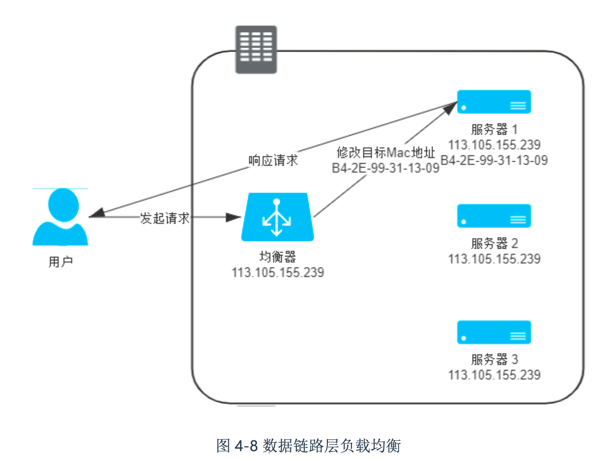

## 网络

### 负载均衡 （路由转发）

### 四层负载均衡
#### 直接转发 VIP --- 数据链路层负载均衡
修改数据链路层的MAC地址， 但是MAC地址只能在同一个子网中修改后访问，所以该方式的负载均衡转发，不能垮子网

同时需要目标地址的ip和负载均衡器的ip保持一致，这样目标地址才能直接影响请求

#### IP通道  --- 网络层负载均衡
通过负载均衡器在ip层另外包装一个 ip层的header（不修改原始ip数据包），目标服务器需要能够解析负载均衡器的ip层，并将其丢弃

因为没有修改原始ip包，所以可以跨子网，同时是目标服务器之间响应给客户端，所以目标服务器的ip必须和负载均衡器的ip相同

#### NAT  --- 网络层负载均衡
通过负载均衡器在ip层将目标ip修改成目标的服务器的ip，目标服务器处理请求后，将源ip修改成负载均衡器的ip

这样目标服务器不直接响应给客户端，所以负载均衡器的ip和目标服务器的ip可以不一样

但是这样的问题就是所有的请求都会经过负载均衡器，负载均衡器的带宽会成为性能瓶颈

### 应用层负载均衡
