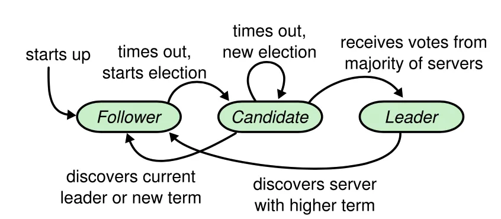

## raft 分布式一致性算法

https://juejin.cn/post/6907151199141625870


raft实现上的优点：（相比如paxos来说，paxos难以理解和工程化实现比较困难）
 - raft协议将共识协议分解成几个模块：leader选举、日志复制和安全性和成员变更。
 - raft使用随机的方法简单粗暴地在选举失败时快速放弃并选举

### Leader的选举

raft协议包含三种角色：follower、candidate、leader。

follower：仅响应leader和candidate的请求；

leader：所有客户端的请求由leader处理。如果请求发到了follower，会被重定向到leader。

candidate：follower竞选leader的中间状态。

#### 任期
raft根据角色状态将时间划分为不同的任期，在一个任期内最多只有一个leader。

在竞选leader时，所有的follower -> candidate 竞选，但是由于可能有多个candidate导致当前任期无法选择出leader
(原因是：一个follower只能投一票，在多个candidate时，可能大家票数相同)，等待一下一个任期,然后这里candidate使用不用的随机时间(150-300ms)后重新竞选


#### 选举过程
下面是状态流转图：




raft集群的稳定状态中，leader会周期性的向follower发送心跳包，followed会周期的收到leader的心跳包，如果follower在超时时间内收到心跳包，则保持follower状态。

如果在超时间内没有收到leader的心跳包，那么follower就会变成candidate并投自己一票，同时向其他的节点广播自己竞选投票

```text
Raft使用心跳机制来触发leader选举。当server启动的时候是处于follower状态，当它可以收到来自leader或者candidate的有效RPC请求时就会保持follower的状态。Leader发送周期性的心跳(不含日志的AppendEntries RPC)给所有的follower来确保自己的权威。如果一个follower一段时间(称为election timeout)没有收到消息，它就会假定leader失效并开始新的选举。
为了开始新一轮选举，follower会提高自己当前的term并转为candidate状态。它会先给自己投一票然后并行向集群中的其他server发出RequestVote RPC，candidate会保持这个状态，直到下面三种事情之一发生：
(a) 赢得选举。当candidate收到了集群中相同term的多数节点的赞成票时就会选举成功，每一个server在给定的term内至多只能投票给一个candidate，先到先得。收到多数节点的选票可以确保在一个term内至多只能有一个leader选出。一旦一个candidate赢得选举，它就会成为leader。它之后会发送心跳消息来建立自己的权威，并阻止新的选举。
(b) 另一个server被确定为leader。在等待投票的过程中，candidate可能收到来自其他server的AppendEntries RPC，声明它才是leader。如果RPC中的term大于等于candidate的current term，candidate就会认为这个leader是合法的并转为follower状态。如果RPC中的term比自己当前的小，将会拒绝这个请求并保持candidate状态。
(c) 没有获胜者产生，等待选举超时。candidate没有选举成功或者失败，如果许多follower同时变成candidate，选票就会被瓜分，形不成多数派。这种情况发生时，candidate将会超时并触发新一轮的选举，提高term并发送新的RequestVote RPC。然而如果不采取其他措施的话，选票将可能会被再次瓜分。
Raft使用随机选举超时来确保选票被瓜分的情况很少出现而且出现了也可以被很快解决。election timeout的值会在一个固定区间内随机的选取(比如150-300ms)。这使得在大部分情况下仅有一个server会超时，它将会在其他节点超时前赢得选举并发送心跳。candidate在发起选举前也会重置自己的随机election timeout，也可以帮助减少新的选举轮次内选票瓜分的情况。

```

```text
raft如何避免选出多个leader？
   在一个任期内，一个follower最多只能为一个candidate投票，而candidate只有赢得了大多数选票才能竞选成功，所以不会选出多个leader

竞选结果如何快速收敛
   为了避免反复出现因为多个candidate竞争出现竞选失败的问题，在一个split vote出现后，每个candidate等待一个随机的时间（如150~300ms之间的任何一个值）后重新发起竞选，以减少竞选竞争的概率，最终快速收敛竞选结果。
```

#### 日志复制(Log Replication)

leader 通过向其他server发出AppendEntries RPC来复制日志

follower由于网络同步原因，任期迭代原因，可能会存在，比如leader少log-entry 和多log-entry的情况
```text
针对上面的情况raft通过对比，同时必须以follower为准的方式解决

具体方案如下：
leader发送AppendEntries RPC请求，请求中携带了最新的log-entry(包含任期和index信息)，follower接收到请求后，和自己的日志信息对比，如果找不到对应的任期和index就直接拒绝
leader没有收到follower的AppendEntries RPC请求回复，就知道follower没有当前的任期和index，于是leader就向前拿log-entry再发送AppendEntries RPC请求给follower，长此以往到leader收到follower的AppendEntries RPC请求的响应后，就知道follower的日志和自己的一样了

如果leader发现自己的日志和follower是完全匹配的，leader就可以发送不带有日志数据的AppendEntries(心跳)来节省带宽。一旦matchIndex追上了nextIndex，leader应当开始发送日志数据。

```

#### raft在选举的时候，就保证选举出来的leader包含了所有的已经committed的日志
前提是： committed 的日志是建议在大多数节点都成功的时候，才说明这个日志是committed的；选举时，需要大多数同意才行，所以在选举阶段肯定是从最新的committed的节点中选举出来的leader

Raft使用投票过程来确保选举成为leader的candidate一定包含全部committed的日志。
Candidate必须联系大部分节点以赢得选举，也就意味着每一个committed日志至少存在于其中一个节点上(复制超过一半节点才会commit)，如果candidate的日志至少和这一大部分节点的日志一样新，它就会含有全部已提交的日志。
RequestVote RPC实现了这一限制：RPC请求包含着candidate的日志信息，其他节点如果发现自己的日志比candidate的日志更新，就回拒绝该请求。

Raft通过比较最后一条日志的index和term来决定谁更新一些。如果term不一致则拥有更大的term日志更新，如果term一样，则index更大的日志更新。

#### raft在确认可以committed，准备committed时然后leader崩溃了
如果一条日志成功复制到大多数节点上，leader就知道可以commit了。如果leader在commit之前崩溃了，新的leader将会尝试完成复制这条日志。
然而一个leader不可能立刻推导出之前term的entry已经commit了。图3.7展示了这样的情景，已经复制到大多数节点的日志可能会被覆盖。为了消除这种可能，

解决方案： 直接提交日志，这样会携带之前的
```text
Raft不会通过计算已经复制的数目来提交以前term的日志，它只会提交当前term中的日志。一旦当前term的日志committed，那么之前的term也会被间接提交。这样做更简单。
```

### raft 集群成员的变化
保证配置更新期间的安全性是面临的第一个挑战，必须确保在同一个term中不会有两个leader被选举出来


