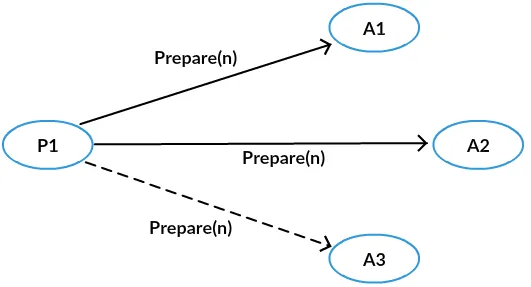
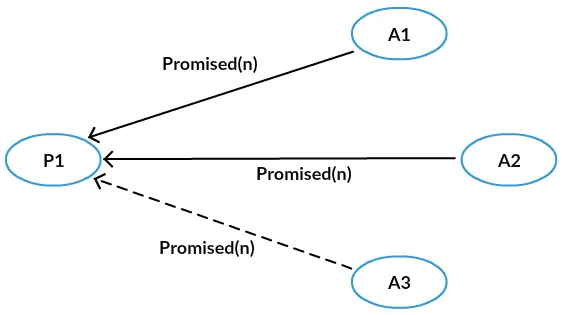
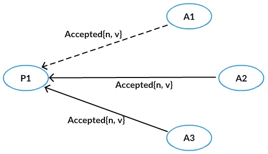

## 分布式相关的学习

### 一致性Hash
一致性hash虽然很好，可以解决动态加入集群路由时，只影响少部分路由(用户)

但是存在如下问题： 
```text
本地可根据一致性Hash规则和机器列表计算请求Key路由。
但是这个方式灵活度低，比如单机故障或数据损坏，需要等待机器替换或检修后才能恢复数据，
单Set或单机过载，需要整体扩容才能达到扩容单Set或单机的目的
```

解决方式：
Hash + range
```text
将路由分成千万级的路由，即有千万级的bucket; 然后再将千万级路由通过range改成万级路由

比如: bucket(1000) - bucket(2000) 合成一个range

这样做的目的，主要是方便range层可以做更细粒度的拆分和组合 -- 这样就可以解决 单Set或单机过载，需要整体扩容才能达到扩容单Set或单机的目的
```


### 分布式一致性
2pc
3pc
tcc

强一致性
弱一致性
最终一致性

### 分布式共识算法
#### paxos   找一个golang的开源项目，研究一下
```text
Proposal Value：     提议的值
Proposal Number：    提议编号，要求提议编号不能冲突
Proposal：           提议 = 提议的值 + 提议编号
Proposer：           提议发起者
Acceptor：           提议接受者
Learner：            提议学习者

记{n，v}为提议编号为n，提议的值为v的提议，记(m，{n，v})为承诺了Prepare（m）请求，并接受了提议{n，v}。
```
prepare阶段：


promised阶段:  向proposal保证不再接收比n小的提议号
```text
这里分两种情况：
1、acceptor之前没有accept过提议号，那么直接返回当前提议号
2、acceptor之前有accept过提议号，那么返回比当前提议号小的，最大的提议号和对应的值  ---重要，这个是保证(n,v)被多数acceptor接收后，保证(m,v1)其中 m>=n 且 v != v1 的关键
```


accept阶段:
```text
分两种情况：根据promised的阶段来的
1、如果都返回的是当前的提议号，那么直接在accept中使用(n,v)
2、如果acceptor返回了自己accept过的最大的提议号(小于n)，比如(n1,v1),(n2,v2),那么proposal从中选出最大的v，比如n1>n2,那么accept中使用(n,v1)
```


accepted阶段:  acceptor在不违背之前的约定下接受proposal的提议号(n,v1) ，那么该v1被chosen


```text
Paxos原命题：
如果一个提议｛n0，v0｝被大多数Acceptor接受，那么不存在提议｛n1，v1｝被大多数Acceptor接受，其中n0 < n1，v0 != v1。
Paxos原命题加强：

如果一个提议｛n0，v0｝被大多数Acceptor接受，那么不存在Acceptor接受提议｛n1，v1｝，其中n0 < n1，v0 != v1。

Paxos原命题进一步加强：

如果一个提议｛n0，v0｝被大多数Acceptor接受，那么不存在Proposer发出提议｛n1，v1｝，其中n0 < n1，v0 != v1。

如果“Paxos原命题进一步加强”成立，那么“Paxos原命题”显然成立。下面我们通过证明“Paxos原命题进一步加强”，从而证明“Paxos原命题”。论文中是使用数学归纳法进行证明的，这里用比较紧凑的语言重新表述证明过程。
```

```text
通过上面的证明过程，我们反过来回味一下协议中的细节。

1、为什么要被多数派接受？
因为两个多数派之间必有交集，所以Paxos协议一般是2F+1个Acceptor，然后允许最多F个Acceptor停机，而保证协议依然能够正常进行，最终得到一个确定的值。

2、为什么需要做一个承诺？
可以保证第二阶段A中Proposer的选择不会受到未来变化的干扰。另外，对于一个Acceptor而言，这个承诺决定了它回应提议编号较大的Prepare请求，和接受提议编号较小的Accept请求的先后顺序。

3、为什么第二阶段A要从返回的协议中选择一个编号最大的？
这样选出来的提议编号一定不小于已经被多数派接受的提议编号，进而可以根据假设得到该提议编号对应的值是Chosen的那个值。
```


zab
#### raft


### 学习资料
https://www.bilibili.com/video/av61253978/?vd_source=af7fc93de0784710a99b706864f20e14


### 业界主备切换方案主要有两种
一种是依赖分布式锁等外部机制进行唯一操作者控制，其中最为经典的是BigTable架构，为了避免tablet读写脑裂，切换时间大概在30秒到1分钟
另一种是基于内置的共识算法（常用的是Raft协议）进行主备切换，为了避免Lease Read机制下读到旧数据，切换时间大概在15秒到30秒，目前业界大部分系统采用这种方案