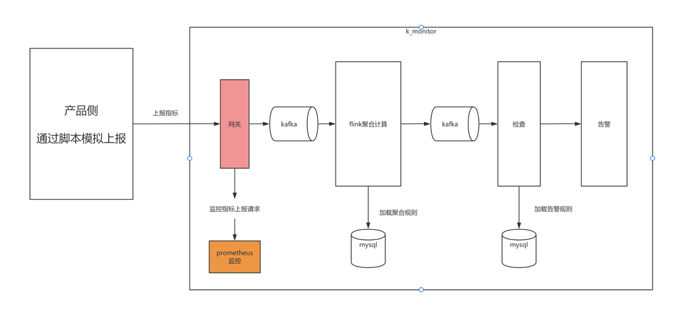

## k_monitor
k_monitor 项目用实践联手，整合了所有需要巩固的知识点，比如自己实现了一个rpc框架、名字服务器(用于rpc寻址)、日志输出等等

### 架构设计

#### 架构1
基于prometheus的实现

1、数据采集
2、prometheus指标上报
3、基于prometheus配置告警规则，触发告警

#### 架构2

### 设计krpc框架  -- 后续实现
参考 grpc、trpc的实现

krpc基于插件式开发，名字服务、日志服务、指标服务、配置中心服务、其他中间件服务(mysql、redis、kafka)等都通过插件的方式，可以插拔集成部署

#### 名字服务
实现一个简单的名字服务，包含的功能有：
服务端：
 - 服务注册 

客户端：
 - 服务发现
 - 服务路由
 - 服务容灾，降级处理

#### 配置中心
发布-订阅模式

