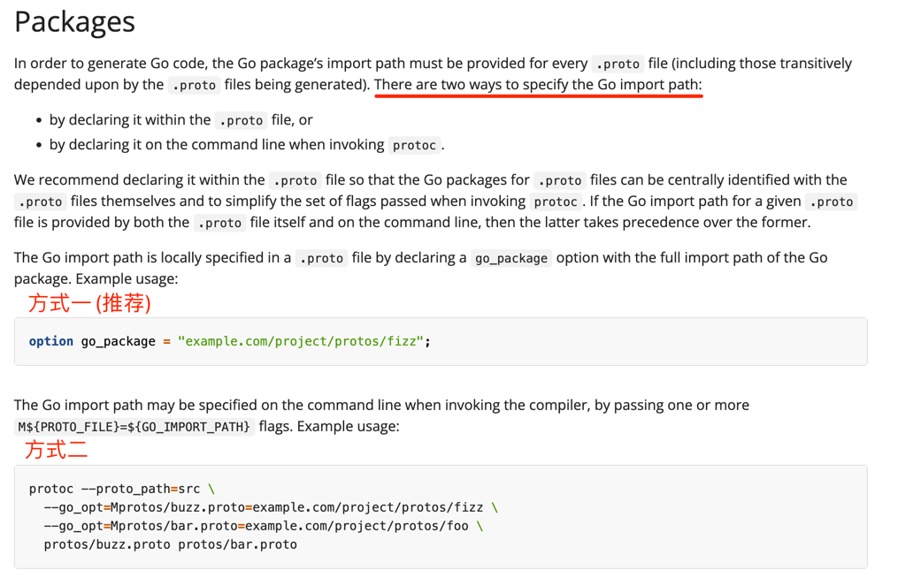

## 一、生成protoc-gen-go代码
1、安装go插件
```text
go install google.golang.org/protobuf/cmd/protoc-gen-go@latest
```
2、到generated_code目录执行protoc命令
```bash
protoc --proto_path=proto --go_out=services --go_opt=paths=source_relative managerService.proto
```
可能会得到如下错误:
```text
protoc-gen-go: unable to determine Go import path for "managerService.proto"

Please specify either:
        • a "go_package" option in the .proto source file, or
        • a "M" argument on the command line.

See https://protobuf.dev/reference/go/go-generated#package for more information.
```

需要在proto文件中，指定go_package
```text
option go_package = "protobuf/usecase/generated_code/proto/managerService";

目前我使用的是本地路径，-----不知道会不会有问题 ？？
```
成功执行后，会在相对路径的services（需要自己手动创建）下生成managerService.pb.go文件


**注意: 这个命令只会生成pb.go文件，如果proto文件中定义了service rpc信息，不会生成rpc.go文件**

## 二、生成带有rpc的代码
[grpc-go-quickstart](https://grpc.io/docs/languages/go/quickstart/) <br/>
1、安装go插件
```text
go install google.golang.org/grpc/cmd/protoc-gen-go-grpc@latest
```

2、到generated_code目录执行protoc命令
```bash
protoc --go_out=. --go_opt=paths=source_relative \
    --go-grpc_out=. --go-grpc_opt=paths=source_relative \
    helloworld/helloworld.proto
```
需要通过 --go-grpc_out 指定输出位置， --go-grpc_opt指定相关配置；paths=source_relative表示相对路径
```bash
protoc --proto_path=proto --go_out=services --go_opt=paths=source_relative \
      --go-grpc_out=services --go-grpc_opt=paths=source_relative managerService.proto
      
      
protoc --proto_path=proto --go_out=proto --go_opt=paths=source_relative \
      --go-grpc_out=proto --go-grpc_opt=paths=source_relative managerService.proto
```

**注意： 一般proto文件和生成的pb文件和rpc文件都是放在同一个目录下的**