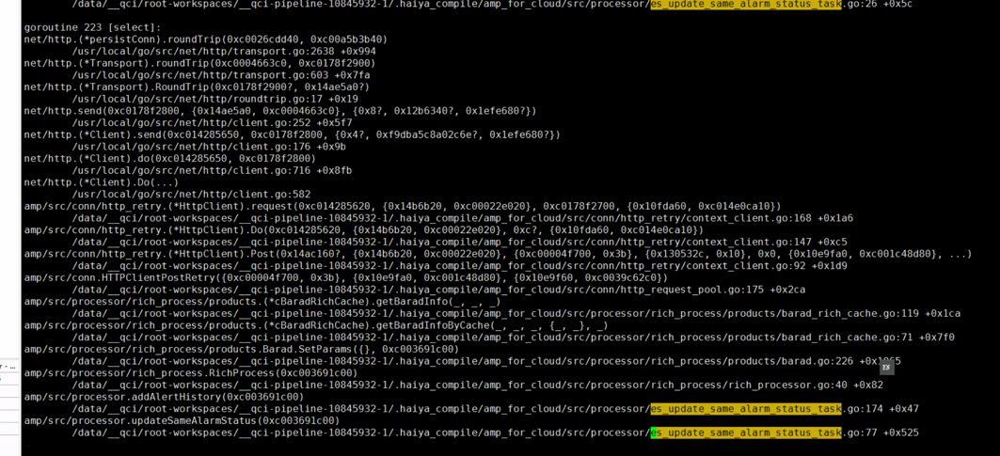

## cpu占用200%导致业务异常问题排查

### 现象
用户的告警能正常告警，但是产生的告警但是却没有正常恢复(实际上指标已经不满足触发条件了，已经恢复了)

排查pod的使用情况，top信息，发现用户进程的cpu 200%的使用率

### 定位排查
1、通过top查看，发现应用程序cpu使用率200%，初步判断，可能是cpu使用率太高导致的；但是cpu的平均使用率不高，疑惑？？
2、查看pod的cpu配置，发现是3G,最大应该达到300%；
3、本来想通过pidstat查看用户进程的相信信息，但是用户的pod里面无法安装
4、那怎么办了？ 不知道怎么排查了，通过查看代码时发现，应用代码使用了gops agent来监控应用程序，所以我们可以通过gops来查看应用程序的pprof等信息
5、但是用户的pod无法执行go get 或者go install，因为没有安装go sdk，即便安装了go sdk也不连接外网，所以也不能正常安装
https://github.com/google/gops
```text
$ go install github.com/google/gops@latest
```
6、于是想到了，将gops打包成二进制，上传到pod中，然后执行
```text
1、下载gops的源代码
https://github.com/google/gops/releases

2、然后来打包成二进制，然后上传到pod上
解压下载的源码，然后执行go build
GOOS=linux GOARCH=amd64 go build -o gops
```

7、通过执行一下命令查看应用查询的信息
```text
1、gops
2、gops <pid|addr>
3、gops stack  --- 查看goroutine的状态
4、gops pprof-cpu <pid|addr>  --- 查看cpu的使用信息 （采集成二进制文件，需要通过go tool pprof分析）
5、gops pprof-heap <pid|addr>
```
8、分析pprof-cpu
```text
需要提前安装 brew install graphviz

go tool pprof -http=:8088 profile1739135662
```


发现99%的cpu都在执行 t_es_update_invalid_status_task
只有0.5%cpu在执行 es_update_same_alarm_status_task

于是查看相关代码

拿到cpu的goroutine
```go
for {
	select {
    case invalidCondition := <-tasks:
        //updateInvalidStatus(invalidCondition)
        //updateInvalidStatusV2(invalidCondition)
        updateInvalidStatusV3(invalidCondition)
    default:  // 这里会一直消耗cpu，两个协程，就会消耗2核cpu -- 可恶的代码
        if invalidConditionProducingQuit {
            return
        }
    }
}
```

拿不到cpu的goroutine
```go
func consumerUpdateSameAlarmStatusTask() {
	defer PostProcessingConsumerTaskHandler()
	for {
		select {
		case msg := <-tasks:
			updateSameAlarmStatus(msg)
		case <-updateSameAlarmStatusProducingQuit.Done():
			return
		}
	}
}
```

通过查看总是能拿到cpu的goroutine的代码发现，在执行select的时候，总是执行了default语言，而default语句是一个bool的判断语句，这里会一直消耗cpu
这里的代码创建了两个这样的goroutine，所有应用进程总是消耗200%的cpu

#### 但是告警历史不能恢复的情况还是没有排查到
于是查看执行告警恢复状态修改的goroutine，看看其的堆栈信息

从堆栈信息看到，在修改告警恢复状态的时候，执行了告警丰富，然后阻塞到告警丰富的http请求中

于是，查看与目标服务的连接信息
```text
netstat -au | grep 8099   // 查看与目标服务的连接信息
```
抓包，看一下请求信息
```text
tcpdump -i eth0  dst 1.1.1.1 and dst port 8099 -nn -vvvAs0
```
从抓包的信息中，可以看出请求的requestid，然后拿到reqeustit检索相关日志，发现告警丰富失败了，且失败的原因是对应的规则ruleid找不到

于是定位ruleid发现，主库和地域库的数据不一致，然后导致了同步到检测器中的数据有误

修复数据后，重启服务，程序正常

